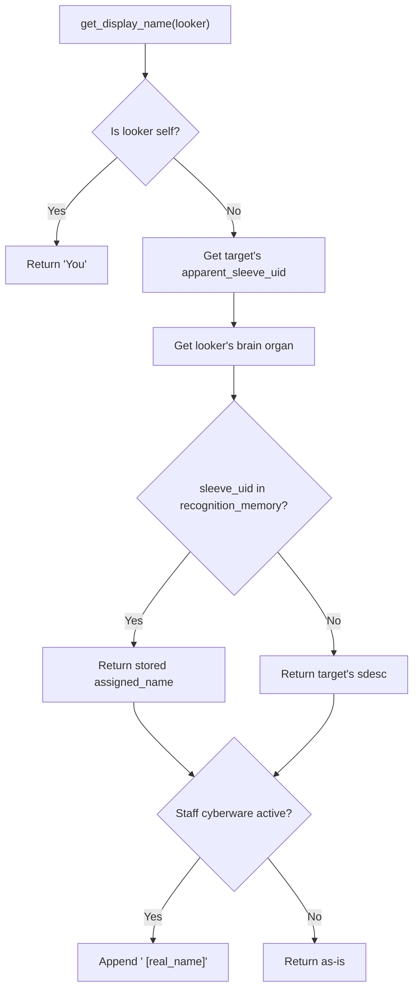

# Identity & Recognition System Specification

## Overview

Characters in Gelatinous are currently identified everywhere by their `key` (real name). This spec introduces a **sleeve-based recognition system** where characters see strangers by physical description, manually assign names, and store recognition in organic memory (the brain organ). The system is designed so cybernetic memory (cyberbrain, digital ID) can plug in seamlessly later.

This is foundational infrastructure. Identity and recognition form the backbone of future **memory**, **forensics**, **social deception**, **communication**, and **posing** systems. Every NPC is a full participant — all Characters have brains with recognition memory.

### Design Principles

1. **Physical identity** — Recognition is based on the physical sleeve (body), not consciousness. Same body = same recognition across clones.
2. **Unique by default** — The sdesc system uses enough physical traits and visible state to make characters distinguishable most of the time without effort.
3. **Obscurable with effort** — Characters can obscure their identity, but only if they're meticulous. Half-measures leave tells.
4. **Per-observer truth** — Every character in a room may know other characters by different names. Messages must render per-observer.
5. **RAG-ready memory** — Recognition entries are rich documents with temporal, spatial, and contextual metadata, designed for future retrieval-augmented generation.
6. **Generic grammar** — The grammar engine serves identity now and the posing system later. Built generic from day one.

---

## Core Concepts

### Sleeve

A physical body. Each sleeve has inherent, observable physical traits (height, build, sex) and a unique `sleeve_uid` (UUID). Flash clones are physically identical and inherit the same `sleeve_uid`. A sleeve's identity is what others see — not what consciousness inhabits it.

### Short Description (sdesc)

What strangers see instead of a name. Composed from observable physical traits:

```
"a {physical_descriptor} {keyword} {distinguishing_feature}"
```

- **Physical descriptor** — auto-derived from height × build (immutable without a new sleeve)
- **Keyword** — player-selected via `@shortdesc`, gender-gated
- **Distinguishing feature** — auto-derived from visible state: clothing > hair > nothing

Skintone is deliberately excluded from the sdesc. It appears only in the longdesc when someone `look`s at the character directly.

### Recognition

A per-character memory mapping stored on the brain organ: "I know the person with sleeve_uid X as [name], and here's everything I remember about them." When you see someone whose sleeve_uid is in your memory, you see the name you assigned. When you don't recognize them, you see their sdesc.

### Apparent Identity

What the recognition pipeline actually resolves against. Normally your real `sleeve_uid`, but the `appear` (disguise) command can substitute a fake one. The sdesc is also overridable through `appear`, but the distinguishing feature always reflects actual visible state — true disguise requires changing your clothes.

---

## Short Description (sdesc) System

### Composition

The sdesc is assembled from three components:

```
article + physical_descriptor + keyword + distinguishing_feature
```

Examples:
- `"a lanky man in a leather jacket"`
- `"a compact woman with blonde braids"`
- `"a heavyset droog in red power armor"`
- `"a diminutive kid"`
- `"an athletic dame with cropped white hair"`
- `"a towering bloke in a torn lab coat"`

The article (`a` / `an`) is determined by the grammar engine based on the first phoneme of the physical descriptor.

### Physical Descriptor Table

Derived from the cross-product of height and build. Players select height and build at character creation; the descriptor is auto-derived and cannot be directly set.

**Heights**: short, below-average, average, above-average, tall
**Builds**: slight, lean, athletic, average, stocky, heavyset

| | slight | lean | athletic | average | stocky | heavyset |
|---|---|---|---|---|---|---|
| **short** | diminutive | wiry | compact | short | squat | rotund |
| **below-avg** | slight | lithe | spry | unassuming | stout | portly |
| **average** | slender | lean | athletic | average | stocky | heavyset |
| **above-avg** | willowy | rangy | strapping | tall | brawny | hulking |
| **tall** | lanky | gaunt | towering | tall | burly | massive |

30 unique descriptors. These are setting-neutral and describe observable silhouette.

### Keyword List

Players select their keyword via `@shortdesc`. Keywords are gender-gated: feminine-presenting and gender-neutral keywords are available to female characters, masculine-presenting and gender-neutral to male characters. The `appear` command allows crossing this boundary.

**Feminine-presenting:**
female, girl, lass, woman, matron, grandma, hag, granny, madam, lesbian, dyke, tomboy, chick, gal, chica, vixen, diva, dame, sheila, mona, bimbo, bitch, lady, senorita, chola, devotchka

**Masculine-presenting:**
male, boy, lad, man, patron, grandpa, geezer, gramps, gentleman, twink, fag, femboy, guy, fellow, dude, playa, pimp, bloke, bruce, mano, bro, douche, stiff, hombre, cholo, droog

**Gender-neutral:**
person, kid, urchin, human, citizen, elder, fossil, fleshbag, denizen, queer, neut, snack, walker, chum, charmer, star, mate, smoker, meatsicle, punk, clone, wageslave, baka, androog, suit

### Distinguishing Feature Derivation

The distinguishing feature is the final clause of the sdesc. It is **always auto-derived** from the character's actual visible state — players cannot set it directly. This ensures the sdesc is always truthful to what observers can actually see.

**Priority order:** clothing > hair > nothing

#### Clothing-based Feature

The system selects the most visually prominent worn item. Prominence is determined by:
1. Outermost layer (what's on top)
2. Largest coverage area (full-body > torso > head > extremities)
3. If multiple items tie, the most recently equipped takes precedence

Format: `"in {article} {item_sdesc}"` — e.g., `"in a leather jacket"`, `"in red power armor"`, `"in a tattered lab coat"`

Items will need a `sdesc` or `worn_sdesc_short` attribute for this purpose — a brief, recognizable description suitable for the sdesc clause.

#### Hair-based Feature

If no clothing provides a distinguishing feature (nude, very minimal clothing), the system falls back to hair.

Format: `"with {color} {style}"` — e.g., `"with red dreadlocks"`, `"with cropped white hair"`, `"with long black braids"`

If the character is bald or has no hair attribute set, this is skipped.

If a head covering (hood, helmet, hat) is worn, hair is hidden and not used even as fallback.

#### No Feature

If the character has no visible clothing and no visible hair (bald + nude, or fully concealed), the sdesc has no distinguishing feature clause:

```
"a lanky man"
"a compact woman"
```

This makes the character harder to distinguish — which is realistic.

### Hair Attributes

Two new attributes selected at character creation:

- **`db.hair_color`** — e.g., "red", "black", "blonde", "white", "brown", "gray", "blue", "green", "pink", "purple", "silver", "auburn" (or None/bald)
- **`db.hair_style`** — e.g., "cropped", "short", "long", "braided", "dreaded", "mohawk", "ponytail", "shaved sides", "curly", "straight", "matted", "slicked" (or None/bald)

Combined for display: `"{hair_color} {hair_style} hair"` → `"red dreaded hair"` or shorthand like `"red dreadlocks"`. The exact phrasing can use a small mapping table for natural-sounding combinations (e.g., "dreaded" + color → `"{color} dreadlocks"`).

### `@shortdesc` Command

```
@shortdesc <keyword>
```

Changes the player's keyword component only. Validates against the gender-gated keyword list. The physical descriptor and distinguishing feature cannot be set this way — they reflect reality.

```
> @shortdesc droog
You will now appear as "a lanky droog in a leather jacket" to those who don't know you.
```

---

## Recognition System

### Recognition Pipeline



### `get_display_name` Override

The central hook. Currently returns `self.key` (Evennia default). Overridden on Character:

```python
def get_display_name(self, looker, **kwargs):
    """Return identity-aware display name based on looker's recognition."""
    if looker == self:
        return "You"  # Self-perception
    
    # Get apparent identity (real or disguise)
    apparent_uid = self.get_apparent_sleeve_uid()
    
    # Check looker's recognition memory
    recognized_name = looker.recall_name(apparent_uid)
    
    if recognized_name:
        display = recognized_name
    else:
        display = self.get_sdesc()
    
    # Staff cyberware overlay
    if looker.has_identity_overlay():
        display = f"{display} [{self.key}]"
    
    return display
```

### Memory Data Model

Each recognition entry is a rich document, designed for future RAG integration:

```python
recognition_memory = {
    "<sleeve_uid>": {
        # Core identity
        "assigned_name": str,           # What the rememberer calls them
        
        # Temporal context
        "first_seen": str,              # ISO timestamp of first encounter
        "last_seen": str,               # ISO timestamp of most recent encounter
        "times_seen": int,              # Total encounter count
        
        # Spatial context
        "location_first_seen": str,     # Room name/key where first encountered
        "location_last_seen": str,      # Room name/key where last seen
        "locations_seen": [str],        # All locations where encountered
        
        # Appearance snapshot
        "sdesc_at_first_encounter": str,  # What they looked like initially
        "sdesc_at_last_encounter": str,   # What they looked like most recently
        
        # Player-authored
        "notes": str,                   # Free-text notes (player-written)
        "tags": [str],                  # Player-assigned tags ("dangerous", "merchant", "ally")
        
        # System-derived
        "confidence": float,            # 0.0-1.0, Resonance-influenced recognition certainty
        "relationship_valence": str,    # "hostile", "neutral", "friendly", "unknown"
        
        # Interaction log (capped, rolling window)
        "recent_interactions": [
            {
                "timestamp": str,       # ISO timestamp
                "location": str,        # Where it happened
                "type": str,            # "combat", "trade", "conversation", "observation"
                "summary": str,         # Brief auto-generated description
            }
        ],
    }
}
```

This is stored as a db attribute on the brain organ, keyed by `sleeve_uid`. The `recent_interactions` list should be capped (e.g., last 20 interactions per entry) to prevent unbounded growth, with older interactions eligible for summarization or archival.

### Assigning Names

**`assign` command:**

```
assign <target> as <name>
assign <target> = <name>
```

Stores the name in the assigner's brain recognition memory for the target's apparent `sleeve_uid`. Any name is valid — false names are always possible. Reassignment overwrites.

```
> assign tall man as Jorge
You will now remember this person as "Jorge".

> assign 2nd lanky dude as Sketchy Pete
You will now remember this person as "Sketchy Pete".
```

If the target is already recognized under a different name:

```
> assign Jorge as Johnny Twoshoes
You update your memory: the person you knew as "Jorge" is now "Johnny Twoshoes".
```

**Digital ID exchange (Phase 4 — Cybernetics):**

A character with a cyberbrain can broadcast their digital identity over the air. The receiver's cyberbrain auto-stores the transmitted name and sleeve_uid. This is a certificate-exchange model — fast, impersonal, verifiable within the digital trust framework.

Socially, demanding someone flash their digital ID is a faux pas in most contexts — it implies distrust. This is a social norm enforced by player culture, not game mechanics.

---

## Memory Architecture

### Organic Memory (Brain Organ)

Recognition data lives on the brain organ object (`world/medical/constants.py` defines the brain organ with `container: "head"`, `vital: True`, `capacity: "consciousness"`).

**Storage:** A new db attribute on the brain organ: `db.recognition_memory` (dict).

**Properties:**
- Populated by explicit player action (`assign` command)
- Future: auto-populated by Resonance-driven proximity detection
- Lost if the brain is destroyed (brain destruction = death, so this is moot for the current character, but matters for brain transplant scenarios)
- Brain damage (non-fatal) carries a risk of partial memory loss — individual entries can be degraded or lost. This is a future enhancement once the memory pool is rich enough to make partial loss meaningful.
- Flash clones get a new brain — they start with empty recognition memory. The clone is a stranger who happens to look like someone others remember.

### Digital Memory (Cyberbrain — Phase 4)

Same data model as organic memory, different storage and capabilities:

- Stored on the cyberbrain implant (future cyberware system)
- Backed up, transferable between sleeves
- Hackable, forgeable, wipeable
- Provides a contact-book UI (traditional list interface)
- Survives resleeving if the cyberbrain is preserved or backed up

**Lookup priority:** Cyberbrain first, then organic brain. First match wins. This means a character with both memory types has redundant recognition — harder to fool.

### Memory and Resonance

Resonance ("Social Connection & Empathy", currently 0 mechanical uses) becomes the governing stat for organic memory:

- **Memory persistence** — Higher Resonance → organic memories persist indefinitely. Low Resonance → risk of memory decay over time (entries lose confidence, eventually drop out).
- **Auto-recognition** — Future: at high Resonance, spending extended time in proximity with someone can auto-populate a recognition entry (you develop an intuitive sense of who they are without formal introduction).
- **Disguise perception** — Higher Resonance → better chance of seeing through disguises (opposed Resonance check: disguiser vs. observer).
- **Confidence** — The `confidence` field in memory entries is influenced by Resonance. Higher confidence means the name displays with certainty; at low confidence, the display could show uncertainty: `"Jorge(?)"` or `"someone who might be Jorge"`.

Exact thresholds and formulas are a tuning concern — the architecture supports Resonance as an input to all these systems.

---

## Grammar Engine

The grammar engine handles article selection, possessive forms, objective forms, and pronoun integration for sdescs and character names. It is designed generically to serve the identity system now and the **posing system** in the future.

### Article Handling

Sdescs always include a grammatically correct article:

- **Indefinite** (default for sdescs): `"a tall man"`, `"an athletic dame"`
- **Definite** (for targeting / objective references): `"the tall man"`, `"the athletic dame"`
- `a` vs `an` determined by phoneme of the following word, not just the letter (e.g., `"an unassuming"` not `"a unassuming"`)

### Possessive Forms

For sdescs:
- `"a tall man's knife"` → article + descriptor + keyword + `'s`
- `"Jorge's knife"` → recognized name + `'s`

For pronouns (self-perception):
- `"your knife"` (when looker is the possessor)

### Objective Forms

When a character is the object of an action:
- `"You attack the tall man."` — definite article for the target
- `"A lanky droog attacks you."` — "you" for self

### Pronoun Integration

The grammar engine interoperates with the existing pronoun system in `_process_description_variables()`. Template variables like `{they}`, `{them}`, `{their}` resolve based on the character's gender. For unrecognized characters, pronouns still derive from the character's actual sex attribute (observable physical presentation).

For recognized characters, pronouns still derive from actual sex — recognition changes the name, not the pronoun set.

### Self-Perception

When `looker == self`:
- `get_display_name(self)` → `"You"`
- Possessive: `"your"`
- Objective: `"you"`
- Subject: `"you"`

### Future: Posing System

The grammar engine is built as a standalone utility module (`world/grammar.py` or similar) that can be imported anywhere. The posing system will use it for:

```
> pose picks up {their} knife and stares at {target}.

Observer who knows both:
→ "Jorge picks up his knife and stares at Maria."

Observer who knows neither:
→ "A lanky man picks up his knife and stares at a compact woman."

Self:
→ "You pick up your knife and stare at a compact woman."
```

The grammar engine must handle:
- Arbitrary noun phrase inflection (articles, possessives, objective case)
- Subject-verb agreement (`"a tall man picks"` vs `"you pick"`)
- Pronoun resolution from character gender
- Definite/indefinite article context (first mention = indefinite, subsequent = definite)

---

## Disguise System

### `appear` Command

```
appear as <physical_descriptor> <keyword>
appear reset
```

Temporarily overrides the character's sdesc physical descriptor and keyword. Also generates a new `apparent_sleeve_uid` (random UUID) so the disguised character doesn't match anyone's existing recognition memory.

```
> appear as short woman
You now appear as "a short woman in a leather jacket" to strangers.
Your physical disguise is active. Remember: your clothing and hair are still visible.
```

**What `appear` changes:**
- `sdesc_physical` (overridden)
- `sdesc_keyword` (overridden)
- `apparent_sleeve_uid` (new random UUID)

**What `appear` does NOT change:**
- Distinguishing feature (auto-derived from actual clothing/hair)
- Longdesc (looking directly at the character reveals physical details)
- Voice (future: communication system could reveal identity)

This is deliberate: true disguise requires effort. If you `appear as short woman` but you're wearing your signature red power armor that everyone in the sector knows, the sdesc reads `"a short woman in red power armor"` — observant characters will connect the dots. Full disguise means changing clothes, covering hair, and altering your keyword/descriptor.

### Disguise Completeness

A disguise is only as good as the effort invested:

| What you change | What observers see |
|---|---|
| `appear` only | Different descriptor/keyword, same clothing/hair |
| `appear` + change clothes | Different descriptor/keyword, different clothing |
| `appear` + change clothes + cover hair | Fully different sdesc, hard to connect to original |
| `appear` + change clothes + cover hair + avoid known associates | Near-complete anonymity |

### Breaking Disguise

Disguise drops under these conditions:
- **Voluntary**: `appear reset`
- **Combat damage**: Wounds to face/head could break the disguise (future: based on damage severity)
- **Death**: Corpse reverts to real identity
- **Clothing removal**: If the distinguishing clothing is removed, the sdesc auto-updates (might reveal identity if hair/body underneath is recognized)
- **Admin/GM intervention**: Staff can strip disguise

### Disguise and Recognition Interaction

- If you're disguised, others see your fake sdesc and your fake `apparent_sleeve_uid`
- Someone who knew your real sleeve sees your fake sdesc — no auto-recognition
- If someone `assign`s a name to your disguised identity, that name is stored against your fake `sleeve_uid`, not your real one — dropping the disguise makes you a stranger again to that person (unless they also know your real sleeve)
- Resonance-based perception checks (future) could see through disguises: opposed Resonance roll, disguiser vs. observer

---

## Per-Observer Rendering

### The Core Technical Challenge

Every room message referencing a character must render differently for each observer. When "Jorge attacks the bandit":
- Observer A (knows both): `"Jorge attacks Skullface."`
- Observer B (knows neither): `"A lanky man attacks a wiry droog."`
- Observer C (knows Jorge only): `"Jorge attacks a wiry droog."`

This affects every system that sends messages to rooms: combat, movement, communication, emotes, environmental events.

### `msg_room_identity` Helper

A centralized helper replaces direct `msg_contents()` calls for any message referencing characters:

```python
def msg_room_identity(location, template, char_refs, exclude=None):
    """Send identity-aware message to all observers in a room.

    Args:
        location: Room to broadcast in.
        template: Message string with {placeholder} tokens for characters.
        char_refs: Dict mapping placeholder names to Character objects.
            e.g., {"actor": attacker_obj, "target": target_obj}
        exclude: Characters to exclude from receiving the message.
    """
    for observer in location.contents_get(exclude=exclude):
        if not hasattr(observer, "msg"):
            continue
        resolved = template
        for placeholder, char in char_refs.items():
            display_name = char.get_display_name(observer)
            resolved = resolved.replace(f"{{{placeholder}}}", display_name)
        observer.msg(resolved)
```

Usage:
```python
msg_room_identity(
    location=room,
    template="{actor} attacks {target} with a knife!",
    char_refs={"actor": attacker, "target": target},
    exclude=[attacker, target],
)
```

### Performance Characteristics

For a room with N observers and a message referencing M characters:
- **Dict lookups**: N × M (recognition memory lookups)
- **String operations**: N × M (placeholder replacements)

With 20 observers and 2 character references: 40 dict lookups + 40 string replacements. This is trivial — microsecond-scale work per message.

**NPC memory storage**: An NPC that has encountered 500 unique characters stores a dict with 500 keys. Each entry is ~500 bytes of metadata. Total: ~250KB per well-traveled NPC. Acceptable.

**Scaling concern**: The real cost is not runtime performance but **refactoring scope**. Every `msg_contents()` call and every `.key` reference in message strings across the codebase must be converted to use `msg_room_identity` or route through `get_display_name`. This is a large, methodical effort (Phase 2).

---

## Target Resolution

Currently, players type character names to target them. With the recognition system, targeting must work with assigned names, sdescs, and ordinals.

### Targeting Priority

When a player types a targeting string (e.g., `attack jorge` or `attack tall man`):

1. **Assigned names** — Check the player's recognition memory for any character in the room whose assigned name matches the input
2. **sdescs** — Match against visible characters' sdescs (partial matching, case-insensitive)
3. **Ordinals** — `"2nd tall man"` uses the existing ordinal system (`get_search_query_replacement`)
4. **Real keys** — Fall through to standard Evennia search (matches `.key` and aliases)

### Implementation Approach

Override `Character.get_search_candidates()` (already exists at `characters.py:515-556`) to inject recognition-aware search results for the searching character. Alternatively, add a custom search hook that checks the searcher's recognition memory.

The existing `CmdAttack` manual substring search (`core_actions.py:110-120`) must be updated to search against assigned names and sdescs, not just `.key`.

### Ambiguity Resolution

If multiple characters match the same target string:
- Ordinals resolve: `"2nd tall man"` → second matching character
- If no ordinal and multiple matches, prompt the player: `"Which one? There are two tall men here."`
- Assigned names should be unique within a player's recognition memory (reassignment overwrites)

---

## Staff Vision

Staff see real names via a cyberware effect auto-granted to all staff characters. This is not a special-case code path — it's the same cyberware system available to players (future).

### Display Format

```
A lanky man [Jorge Jackson] is standing here.
A compact woman [Maria Santos] attacks a heavyset droog [Viktor Kozlov].
```

The real name appears in brackets after the sdesc or recognized name.

### Implementation

A condition/effect on the character (similar to how medical conditions work) that sets a flag checked by `get_display_name`:

```python
def has_identity_overlay(self):
    """Check if this character has identity-revealing cyberware."""
    # Future: check for actual cyberware
    # For now: check for staff overlay condition
    return self.check_permstring("Builder")  # Temporary until cyberware exists
```

The Phase 1 implementation can use a simple permission check as a stopgap. When the cyberware system is built, this becomes a real implant check.

---

## Flash Clone Interaction

Flash clones inherit physical attributes from the original body, including `sleeve_uid`:

| Attribute | Inherited? | Notes |
|---|---|---|
| `sleeve_uid` | Yes | Same physical body template → same recognition |
| `height` | Yes | Physically identical |
| `build` | Yes | Physically identical |
| `hair_color` | Yes | Physically identical |
| `hair_style` | Yes | Physically identical |
| `sex` | Yes | Physically identical |
| `sdesc_keyword` | Yes | Same player preference |
| Brain organ | New (empty) | Fresh brain → blank recognition memory |
| `key` | Modified | Incremented numeral (Jorge → Jorge II) |
| `stack_id` | Yes | Same consciousness |

### Consequences

- **Others recognize the clone**: Anyone who had Jorge's `sleeve_uid` in their memory auto-recognizes Jorge II (same `sleeve_uid` → same assigned name appears)
- **Clone recognizes nobody**: Jorge II starts with an empty brain. Every person is a stranger. This is a significant gameplay consequence of death and resleeving.
- **Digital memory (future)**: If the original backed up their cyberbrain, the clone could restore contacts. Without backup, digital memory is also lost.
- **The clone's system `key` (Jorge Jackson II)** is not what others see — they see whatever name they previously assigned to that sleeve_uid, or the sdesc if they never met the original.

---

## Forensic Integration (Future)

Recognition ties into the existing partial forensic system:

### Blood Pools (`typeclasses/objects.py`)

Blood pools currently store the character's name. With recognition:
- The forensic display routes through the investigator's recognition memory
- If the investigator recognizes the bleeder's sleeve_uid: `"This blood appears to belong to Jorge."`
- If not: `"This blood appears to belong to a lanky man."` (or just `"someone"` if no sdesc data is stored on the blood pool)
- Blood pools should store `sleeve_uid` and `sdesc_at_time` in addition to the existing character name

### Corpses (`typeclasses/corpse.py`)

Corpses already preserve forensic data (original name, dbref, physical description, longdesc, skintone, gender). With recognition:
- Add `sleeve_uid` to corpse forensic data
- Looking at a corpse: investigator sees recognized name or sdesc based on their memory
- Corpse decay interacts with recognition: at advanced decay, the physical features become unrecognizable (already described in existing decay stage text)

### Evidence and Investigation (Future)

When forensic investigation commands are built:
- Evidence sources (fingerprints, DNA, etc.) link to `sleeve_uid`
- Investigators see recognized names or sdescs when examining evidence
- Creates detective gameplay: "The blood at the crime scene belongs to that tall man I saw earlier"

---

## New Character Attributes

### On Character (sleeve-level)

| Attribute | Type | Default | Set By | Persists Across Clones |
|---|---|---|---|---|
| `db.sleeve_uid` | UUID (str) | Generated at creation | System | Yes (flash clones inherit) |
| `db.height` | str | Selected at chargen | Chargen | Yes |
| `db.build` | str | Selected at chargen | Chargen | Yes |
| `db.hair_color` | str or None | Selected at chargen | Chargen / `@hair` | Yes |
| `db.hair_style` | str or None | Selected at chargen | Chargen / `@hair` | Yes |
| `db.sdesc_keyword` | str | Selected at chargen | `@shortdesc` | Yes |

`sdesc_physical` is not stored — it is computed on access from `height` and `build` via the descriptor table.

The distinguishing feature is not stored — it is computed on access from worn items and hair attributes.

### On Brain Organ

| Attribute | Type | Default |
|---|---|---|
| `db.recognition_memory` | dict | `{}` |

### On Items (for sdesc feature derivation)

| Attribute | Type | Purpose |
|---|---|---|
| `db.sdesc_short` | str or None | Brief recognizable description for sdesc feature clause (e.g., "leather jacket", "red power armor") |

---

## Impact on Existing Systems

All locations that currently use `.key` directly or bypass `get_display_name` need refactoring:

| System | File(s) | Current Issue | Required Change |
|---|---|---|---|
| Combat message templates | `world/combat/messages/__init__.py` | Uses `.key` for `attacker_name` / `target_name` | Use `get_display_name` with per-observer rendering |
| Attack processing errors | `world/combat/attack.py:310, 329` | Uses `.key` in messages | Route through `get_display_name` |
| Shield messages | `world/combat/attack.py:231-269` | Uses `get_display_name_safe()` | Already partially correct — verify observer is passed |
| Normal movement | Evennia defaults | `announce_move_from/to` use `.key` | Override with custom per-observer announcements |
| Communication (say/whisper/emote) | Evennia defaults | All use `.key` | Custom command overrides required |
| Death filtering | `typeclasses/characters.py:137-205` | Pattern-matches `.key` in message strings | Refactor to use structured message data |
| CmdAttack target resolution | `commands/combat/core_actions.py:110-120` | Manual substring match on `.key` | Add recognition-aware search |
| Exit drag messages | `typeclasses/exits.py:317-340` | Uses `.key` directly | Route through `get_display_name` |
| Room character listing | `typeclasses/rooms.py:410` | Uses `get_display_name(looker)` | Already correct |
| Combat movement messages | `commands/combat/movement.py` | Uses `get_display_name(observer)` | Already correct |
| Look command / appearance | `typeclasses/appearance_mixin.py` | Uses `get_display_name(looker)` | Already correct |

### Systems Already Correct

Several systems already route through `get_display_name(looker)` and will work automatically once the override is in place:
- Room character listings (`rooms.py:410`)
- Combat movement messages (`commands/combat/movement.py`, ~25 uses)
- Look / appearance rendering (`appearance_mixin.py:363, 397-419`)
- Exit character previews (`exits.py:673`)
- Medical commands (`commands/CmdMedical.py`)
- Clothing commands (`commands/CmdClothing.py`)
- Most inventory/interaction commands

---

## Character Creation Updates

Character creation (both in-game `create` and web-based) must be updated to include identity attribute selection:

### New Chargen Steps

1. **Height selection** — short, below-average, average, above-average, tall
2. **Build selection** — slight, lean, athletic, average, stocky, heavyset
3. **Hair color selection** — from approved list, or bald/none
4. **Hair style selection** — from approved list (contextual based on color choice), or bald/none
5. **Keyword selection** — gender-gated list from the keyword table
6. **Preview** — Show the assembled sdesc: `"You will appear as 'a lanky man with red dreadlocks' to strangers."`

### Sleeve UID Assignment

- New characters: generate a fresh UUID via `uuid.uuid4()`
- Flash clones: inherit `sleeve_uid` from the original character (in `create_flash_clone()` at `commands/charcreate.py:293`)

---

## Migration Strategy

Existing characters need identity attributes backfilled. Use the existing `@fixchar` command pattern:

1. Generate `sleeve_uid` for all existing characters (unique per character)
2. Set default `height` = `"average"`, `build` = `"average"` (or derive from existing descriptive data if possible)
3. Set default `hair_color` and `hair_style` = `None` (forces players to set via `@shortdesc` or `@hair`)
4. Set default `sdesc_keyword` based on existing `sex` attribute (`"man"` for male, `"woman"` for female, `"person"` for ambiguous)
5. Initialize empty `recognition_memory` on all brain organs
6. Staff can run `@fixchar/all` to batch-process

Players should be prompted to customize their sdesc on next login if defaults were applied.

---

## Phased Implementation

### Phase 1 — Foundation

**Scope:** sdesc system, recognition storage, manual assignment, `get_display_name` override, chargen updates.

- New attributes: `sleeve_uid`, `height`, `build`, `hair_color`, `hair_style`, `sdesc_keyword`
- Physical descriptor table in constants
- Keyword list in constants
- Sdesc composition logic
- `recognition_memory` on brain organ
- `Character.get_display_name(looker)` override
- `@shortdesc` command
- `assign` command
- Grammar engine (articles, possessive, objective, self-perception)
- Chargen updates
- Flash clone `sleeve_uid` inheritance
- `@fixchar` migration
- Staff identity overlay (permission-based stopgap)

### Phase 2 — Consistency

**Scope:** Patch all `.key` usage across the codebase.

- `msg_room_identity` helper function
- Combat message templates → per-observer rendering
- Custom say/whisper/emote command overrides
- Custom movement announcement overrides
- Fix `CmdAttack` target resolution
- Fix drag messages, death filter pattern matching
- Target resolution with sdescs, assigned names, and ordinals
- `sdesc_short` attribute on items
- Distinguishing feature auto-derivation from worn items

### Phase 3 — Disguise

**Scope:** The `appear` command and disguise mechanics.

- `appear` command (keyword + physical descriptor override, fake `sleeve_uid`)
- `appear reset`
- Disguise interaction with recognition pipeline
- Disguise breaking conditions

### Phase 4 — Cybernetics

**Scope:** Digital memory and identity exchange.

- Cyberbrain organ/implant (depends on cyberware system)
- Digital memory storage (same data model as organic)
- Digital ID exchange command
- Memory backup/restore mechanics
- Hackable/forgeable contact entries
- Staff identity overlay migrated from permission check to cyberware

### Phase 5 — Resonance Mechanics

**Scope:** Give Resonance full mechanical integration.

- Memory decay curves (low Resonance → memory loss over time)
- Auto-recognition from proximity + time + high Resonance
- Disguise perception checks (opposed Resonance rolls)
- Confidence display (uncertain recognition at low confidence)
- Social reads (emotional state, lie detection during introductions)
- Brain damage → partial memory loss (risk scaled to damage severity)

---

## Appendix: Adjacent Room Sightings

The existing adjacent room sighting system (`rooms.py:440-474`) already shows characters in neighboring rooms anonymously: `"You see a lone figure to the north."` or `"You see a group of N people standing to the north."` This is consistent with the recognition model — at distance, you can't make out details. No changes needed to this system.

---

## Appendix: Existing Forensic Data

For reference, the existing forensic data preserved by the system:

**Blood pools** (`typeclasses/objects.py:468+`): character name, severity, timestamp, age progression, forensic descriptions.

**Corpses** (`typeclasses/corpse.py`): original character name/dbref, account dbref, death time, cause of death, medical conditions, wounds at death, physical description, longdesc data, skintone, gender. Decay stages: fresh (<1h), early (<1d), moderate (<3d), advanced (<1w), skeletal (>1w).

Both need `sleeve_uid` added to their forensic data for integration with the recognition system.

---

## Appendix: RAG Integration Notes

The recognition memory data model is designed to port into a retrieval-augmented generation (RAG) pipeline when the system matures. This appendix documents the intended architecture and recommended stack so infrastructure decisions align with the data model.

### Why RAG

Recognition memory starts as simple dict lookups by `sleeve_uid`, but future use cases require semantic retrieval:

- **Player recall**: `remember the docks` → find all memories with spatial context matching "docks"
- **NPC behavior**: An NPC needs to assess "have I met this person before, and should I be hostile?" based on past interaction history
- **Contextual reactions**: NPCs referencing past encounters in dialogue ("Last time you were here, you started a fight.")
- **Investigation**: "Who have I seen carrying a knife?" → semantic search over appearance snapshots and interaction logs

These queries don't map to exact key lookups — they require semantic similarity search over the text fields in memory entries.

### Data Model Compatibility

The recognition memory schema is RAG-ready by design:

| Field | RAG Role |
|---|---|
| `assigned_name` | Metadata filter (exact match) |
| `first_seen`, `last_seen` | Metadata filter (temporal range queries) |
| `location_first_seen`, `location_last_seen`, `locations_seen` | Metadata filter (spatial queries) |
| `tags` | Metadata filter (categorical queries) |
| `relationship_valence` | Metadata filter (sentiment queries) |
| `confidence` | Metadata filter (certainty threshold) |
| `notes` | **Embedded content** (free-text, semantic search) |
| `sdesc_at_first_encounter`, `sdesc_at_last_encounter` | **Embedded content** (appearance-based search) |
| `recent_interactions[].summary` | **Embedded content** (event-based search) |

Structured fields become metadata filters for pre-filtering. Text fields are embedded for semantic similarity search. This two-stage retrieval (filter → rank) is the standard RAG pattern.

### Recommended Stack

Evaluated against project constraints: runs alongside MUD server in Docker, no GPU required, tens of thousands of small documents, Python-native.

**Vector store — ChromaDB or LanceDB**

| | ChromaDB | LanceDB |
|---|---|---|
| **Backend** | SQLite | Lance columnar format |
| **Deployment** | Embedded (in-process) or client/server | Embedded (in-process) |
| **Python-native** | Yes | Yes |
| **Metadata filtering** | Yes | Yes |
| **Scale ceiling** | ~1M documents | ~10M documents |
| **Docker-friendly** | Yes (pip install) | Yes (pip install) |

Either works. ChromaDB has a larger community and more documentation. LanceDB has better performance at scale and native support for versioned datasets (useful if memory entries are updated frequently). **ChromaDB is the simpler starting point.**

**Embedding model — sentence-transformers**

| Model | Size | Dimensions | Speed (CPU) | Quality |
|---|---|---|---|---|
| `all-MiniLM-L6-v2` | 80MB | 384 | Fast | Good |
| `all-mpnet-base-v2` | 420MB | 768 | Moderate | Better |
| `nomic-embed-text-v1.5` | 550MB | 768 | Moderate | Best (local) |

**`all-MiniLM-L6-v2` is recommended for Phase 1** — small footprint, fast on CPU, sufficient quality for short memory documents (100-500 tokens each). Can upgrade to `nomic-embed-text` later if retrieval quality needs improvement.

**LLM synthesis — deferred**

The LLM layer (interpreting retrieved memories into natural language responses) is a separate decision. Options when the time comes:

- **Local**: Ollama + Mistral/Llama (requires more resources, full autonomy)
- **API**: OpenAI / Anthropic (simpler, ongoing cost, latency dependency)
- **Hybrid**: Local embeddings + API for synthesis (balanced)

This decision depends on the MUD server's resource budget and acceptable latency for NPC dialogue generation. It does not affect the storage or embedding layer.

### Indexing Strategy

Each character's brain maintains its own recognition memory dict (source of truth). The vector index is a **read-through cache** built from these dicts:

```
Brain organ (db.recognition_memory)  ←  source of truth
         ↓ on write
ChromaDB collection (per-character)  ←  vector index
         ↑ on query
Semantic search results              →  returned to caller
```

- **Writes**: When a recognition entry is created or updated, the corresponding document in the vector index is upserted
- **Reads**: Exact lookups (by `sleeve_uid`) hit the dict directly — no vector search needed. Semantic queries hit the vector index.
- **Consistency**: The dict is authoritative. The vector index can be rebuilt from dicts at any time (cold start, migration, corruption recovery).

### Collection Strategy

Two options for organizing the vector store:

**Option A — One collection per character**: Each character's memories are a separate ChromaDB collection. Simple isolation, easy cleanup when a character is deleted. Downside: many small collections if hundreds of NPCs.

**Option B — Single collection with character metadata**: All memories in one collection, with `owner_sleeve_uid` as a metadata field for filtering. Simpler management, better for cross-character queries (e.g., admin searching "who remembers Jorge?"). **Recommended.**

### Document Schema (ChromaDB)

```python
{
    "id": "{owner_uid}_{target_uid}",  # Unique document ID
    "document": "{notes} {interaction_summaries} {sdesc_snapshots}",  # Embedded text
    "metadata": {
        "owner_uid": str,              # Whose memory this is
        "target_uid": str,             # Who is remembered (sleeve_uid)
        "assigned_name": str,          # Name assigned by owner
        "first_seen": str,             # ISO timestamp
        "last_seen": str,              # ISO timestamp
        "times_seen": int,             # Encounter count
        "locations": str,              # Comma-separated location list
        "tags": str,                   # Comma-separated tags
        "relationship_valence": str,   # hostile/neutral/friendly/unknown
        "confidence": float,           # 0.0-1.0
    }
}
```

### Performance Budget

Estimated resource usage for the RAG layer (when implemented):

- **Embedding model in memory**: ~80MB (MiniLM) to ~550MB (nomic)
- **Vector index on disk**: ~50 bytes per dimension per document. At 384 dimensions × 50,000 documents: ~7MB
- **Embedding latency**: ~5ms per document on CPU (MiniLM), batched
- **Query latency**: <10ms for top-K retrieval from 50,000 documents
- **Total additional RAM**: ~100-600MB depending on model choice

This fits comfortably alongside the MUD server in Docker.

### Implementation Timeline

RAG infrastructure is **not needed until Phase 5** (Resonance Mechanics) at the earliest. The recognition system operates on exact dict lookups through Phases 1-4. RAG enables:

- Semantic `remember` command (Phase 5+)
- NPC behavioral memory queries (Phase 5+)
- Investigation system memory searches (future forensics phase)
- Memory decay with semantic importance weighting (Phase 5+)

The data model is ready now. The vector infrastructure plugs in later without schema changes.
