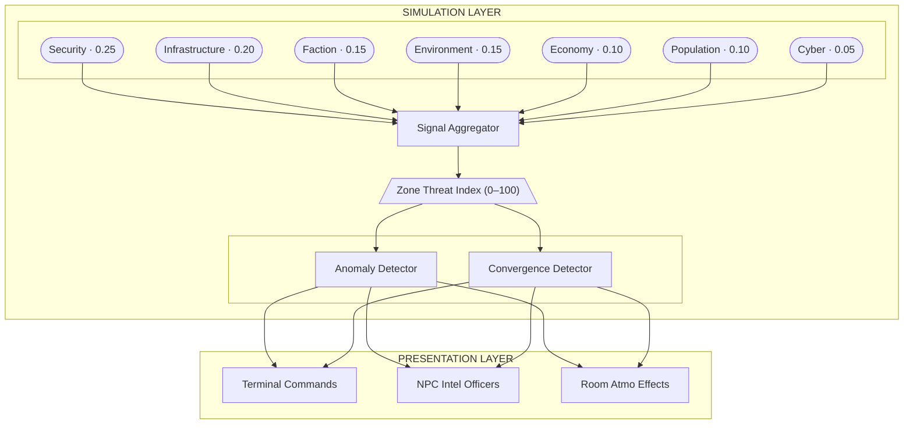

# World State Intelligence System (WSIS) Specification

> **Status:** Design phase -- no implementation yet.
>
> This spec defines a world simulation layer and player-facing intelligence interface
> for tracking colony-wide state across multiple dimensions (security, infrastructure,
> economy, faction, environment). Design reference: [koala73/worldmonitor](https://github.com/koala73/worldmonitor),
> a real-time global intelligence dashboard with 36+ data layers, composite scoring,
> anomaly detection, and AI-generated intelligence briefs.
>
> The core insight: WorldMonitor categorizes and monitors **real-world state** across
> dozens of dimensions with scoring, anomaly detection, and intelligence synthesis.
> A sci-fi MUD needs the same thing for **game-world state** -- faction tensions,
> sector instability, resource flows, infrastructure health, threat assessment.

---

## Overview

WSIS is a two-layer system:

1. **Simulation Layer** -- A background engine that tracks zone/sector state across seven signal layers, computes composite threat scores, detects anomalies against temporal baselines, and identifies convergence zones where multiple signal types spike simultaneously.

2. **Presentation Layer** -- Player-facing interfaces (terminals, NPC intelligence officers, room atmospheric effects) that expose simulation data in-character. Players interact with a living world that evolves based on their actions, NPC faction behavior, and systemic feedback loops.

### Design References

| WorldMonitor Concept | WSIS Equivalent |
|---|---|
| Countries/regions | Zones (districts, sectors, areas of the colony) |
| Country Instability Index (CII) | **Zone Threat Index (ZTI)** -- composite score per zone, 0-100 |
| 36+ data layers | 7 signal layers: security, infrastructure, economy, faction, environment, population, cyber |
| Multi-source signal fusion | Signal bus fusing combat, deaths, faction actions, resource changes, infrastructure events |
| Welford's anomaly detection | Temporal baselines per (zone, signal_type) -- flag deviations via z-score |
| Convergence zones | Multiple signal layers spiking in same zone = escalation multiplier |
| AI intelligence briefs | NPC intelligence officers / terminal readouts synthesizing zone state |
| RSS news feeds | In-game Colony News Network (CNN) -- rumor/news/bulletin system |
| Live entity tracking (flights, ships) | NPC faction patrols, supply convoys, ship movements |
| Infrastructure layers (cables, pipelines, ports) | Colony systems: power grid, life support, comms, docking, transit |
| Chokepoints (Hormuz, Suez, Malacca) | Corridor bottlenecks, docking ports, transit junctions |
| Prediction markets (Polymarket) | Faction odds / betting terminals / intelligence estimates |
| Cyber threat IOCs | Hacking/intrusion events, network breaches |
| Climate anomaly panel | Environmental hazard monitoring (radiation, atmo breach, seismic) |
| Country brief pages | Zone brief -- full dossier per zone with scores, signals, trends, intel |

### Scale

Starting scope: a single offworld colony on a planetary body. The zone abstraction is scale-agnostic -- zones can represent rooms, districts, stations, or entire planetary regions. As the game expands to a full solar system, the same system scales by adding zone hierarchies (zone -> sector -> region -> body).

---

## Architecture



### Module Structure

Follows the established crowd/weather pattern: package with `__init__.py` exposing a global singleton, a `*_system.py` with core logic, and supporting modules.

```
world/
  intel/
    __init__.py              # Exposes global `intel_system` singleton
    zone_system.py           # Zone registry, ZTI computation
    signal_bus.py            # Event aggregation, signal fusion
    anomaly.py               # Welford's algorithm, baseline tracking
    convergence.py           # Multi-signal convergence detection
    layers/
      __init__.py
      security.py            # Combat events, crime, faction hostility
      infrastructure.py      # Power, life support, comms, docking
      economy.py             # Trade, resource flow, market state
      faction.py             # Faction tensions, territorial control
      environment.py         # Atmo quality, radiation, weather severity
      population.py          # Crowd displacement, casualties, migration
      cyber.py               # Network intrusions, system breaches
    reports/
      __init__.py
      brief_generator.py     # Zone/colony-level intelligence briefs
      report_messages.py     # Message pools for terminal readouts
    constants.py             # All WSIS constants
```

---

## Zone System

### Zone Definition

Zones are logical groupings of rooms -- a district, sector, or area of the colony. Each room belongs to exactly one zone. Zones are the unit at which the simulation computes scores.

```python
# New AttributeProperty fields on Room typeclass
zone = AttributeProperty("unzoned", category="intel")
zone_type = AttributeProperty("residential", category="intel")
# Types: residential, commercial, industrial, military,
#        infrastructure, docking, medical, administrative
```

### Zone Registry

A persistent Script that maintains the zone map and computes ZTI scores.

```python
class ZoneRegistry(DefaultScript):
    """
    Global singleton script. Tracks all zones, their rooms,
    and computes Zone Threat Index per zone on each tick.
    """
    # db.zones = {
    #   "sector_7": {
    #       "name": "Sector 7 - Habitation",
    #       "type": "residential",
    #       "rooms": [dbref_list],
    #       "zti_score": 42,          # 0-100 composite
    #       "layer_scores": {
    #           "security": 65,
    #           "infrastructure": 30,
    #           "economy": 25,
    #           "faction": 50,
    #           "environment": 40,
    #           "population": 35,
    #           "cyber": 20,
    #       },
    #       "trend": "rising",        # rising/stable/falling
    #       "convergence_level": 0,   # 0-3 (none/low/medium/high)
    #   }
    # }
```

### ZTI Computation

WorldMonitor's CII uses a weighted multi-signal blend. WSIS follows suit:

| Layer | Weight | Signals |
|---|---|---|
| Security | 0.25 | Combat events, murders, armed NPCs, faction hostility in zone |
| Infrastructure | 0.20 | Power grid %, life support %, comms uptime, structural damage |
| Faction | 0.15 | Faction tension scores, territorial disputes, contested zones |
| Environment | 0.15 | Atmospheric quality, radiation, weather severity, hazards |
| Economy | 0.10 | Trade volume, resource scarcity, black market activity |
| Population | 0.10 | Crowd displacement, casualties, migration pressure |
| Cyber | 0.05 | Network breaches, system intrusions, data theft |

```
ZTI = sum(layer_score * weight) * convergence_multiplier
```

Where `convergence_multiplier` increases when multiple layers spike simultaneously (1.0 normal, up to 1.5 for 4+ layers elevated).


### Escalation Tiers

| ZTI Range | Status | Effects |
|---|---|---|
| 0-20 | STABLE | Normal operations |
| 21-40 | ELEVATED | Minor atmospheric changes, increased NPC patrols |
| 41-60 | UNSTABLE | Visible security presence, crowd nervousness |
| 61-80 | CRITICAL | Lockdowns, infrastructure strain, NPC displacement |
| 81-100 | EMERGENCY | Full crisis -- martial law, system failures cascade |

---

## Signal Layers

### Security Layer

**WorldMonitor reference:** Conflict zones (ACLED/UCDP), military bases, protest events, cyber threats.

**Signals consumed:**
- Combat events (from `CombatHandler` -- emit signal on `start_combat`, `end_combat`)
- Deaths/corpse creation (from `DeathProgressionScript`)
- Weapon discharges (gunfire heard in adjacent rooms)
- NPC faction patrol encounters
- Arrests/detentions

**Score computation:** Rolling window (e.g., last 6 game-hours) of weighted security events normalized by zone room count.

### Infrastructure Layer

**WorldMonitor reference:** Undersea cables, pipelines, internet outages (Cloudflare Radar), datacenters, strategic ports, trade routes.

Colony infrastructure systems, each independently trackable:

| System | WorldMonitor Parallel | Game Mechanic |
|---|---|---|
| Power Grid | Undersea cables / pipelines | % capacity per zone, sector blackouts |
| Life Support | Climate anomaly panel | Atmospheric quality, O2 levels, scrubber status |
| Communications | Internet outages | Comms relay status, jamming, signal degradation |
| Docking | Strategic ports | Landing pad availability, traffic volume |
| Water/Recycling | Infrastructure health | Contamination levels, rationing triggers |
| Transit System | Trade routes | Rail/tram operational status, corridor throughput |

Each system has: `capacity` (0-100%), `status` (operational/degraded/offline/critical), `last_incident` timestamp, `trend` (improving/stable/degrading).

### Economy Layer

**WorldMonitor reference:** 92 stock exchanges, crypto market radar, commodity hubs, WTO trade policy, BIS central bank data.

- **Token economy:** Track velocity (tokens traded per period), inflation/deflation signals
- **Shop inventory levels:** Scarcity indices for weapon/medical/general goods per zone
- **Black market activity:** Illicit trades, contraband detection events
- **Resource extraction:** Mining/salvage output per zone
- **Supply routes:** Convoy status between zones (like WorldMonitor's 19 trade routes with multi-segment arcs through chokepoints)

### Faction Layer

**WorldMonitor reference:** Sanctions regimes, bilateral tensions (GDELT), military deployments, Gulf FDI tracking.

- **Faction tension matrix:** Pairwise tension scores between factions (0-100)
- **Territorial control:** Which faction controls which zones, contested zones flagged
- **Force disposition:** Faction NPC patrol strength per zone (like WorldMonitor's military base layer with 220+ bases from 9 operators)
- **Diplomatic state:** Allied/neutral/hostile per faction pair
- **Player faction actions:** Player kills, trade, espionage contribute to faction scores

### Environment Layer

**WorldMonitor reference:** USGS earthquakes, GDACS disaster alerts, NASA EONET, NASA FIRMS fire detection, climate anomalies vs ERA5 baselines.

- **Weather severity:** Already tracked by `weather_system` -- integrate its intensity level directly
- **Atmospheric hazards:** Radiation zones, toxic leaks, pressure breaches
- **Seismic events:** Tremors, structural instability (planetary body geology)
- **Fire/thermal:** Fires in sectors, heat exchanger failures
- **External threats:** Meteor impacts, solar flare effects (long-term escalation arc for solar system expansion)

### Population Layer

**WorldMonitor reference:** WorldPop density estimation, HAPI humanitarian displacement, ACLED protests, crowd events.

- **Crowd system integration:** Already exists (`world/crowd/`) -- crowd levels per room aggregated to zone level
- **Displacement events:** NPCs fleeing high-ZTI zones (crowd_base_level shifts dynamically)
- **Casualty tracking:** Deaths per zone per period
- **Medical load:** Injured characters per zone, medical facility saturation
- **Migration pressure:** Population flow between zones (like WorldMonitor's HAPI dual-perspective origins vs hosts)

### Cyber/Network Layer

**WorldMonitor reference:** Cyber threat IOCs (Feodo Tracker, URLhaus, AlienVault OTX), APT attribution, C2 servers geo-located on globe.

- **System intrusions:** Hacking events against colony infrastructure
- **Data breaches:** Intelligence leaks, faction secrets exposed
- **Comms interception:** Eavesdropping events
- **AI/automation disruptions:** Rogue automation, drone hijacking
- **Network integrity:** Colony mesh network health, node failures

---

## Signal Bus and Event Aggregation

**WorldMonitor reference:** Multi-source signal fusion -- internet outages, military flights, naval vessels, protests, satellite fires aggregated into unified intelligence picture with per-country and per-region clustering.

### Design

An event-driven bus where game systems emit signals, and the aggregator routes them to the appropriate layer and zone.

```python
class SignalBus:
    """
    Central event aggregator. Game systems emit signals;
    the bus routes them to the appropriate layer and zone.
    """

    def emit(self, signal_type, zone_id, severity, metadata=None):
        """
        Args:
            signal_type: "combat_start", "death", "power_failure",
                         "faction_patrol", "trade_completed", etc.
            zone_id: which zone this affects
            severity: 0.0-1.0
            metadata: dict of additional context
        """
```

### Signal Sources

Hooks into existing Gelatinous systems with minimal changes -- add `signal_bus.emit()` calls at natural hook points:


| Existing System | Hook Point | Signal Emitted |
|---|---|---|
| `CombatHandler` | `start_combat()` | `combat_start` |
| `CombatHandler` | `stop_combat_logic()` | `combat_end` |
| `Character` | `at_death()` | `death` |
| `DeathProgressionScript` | corpse creation | `corpse_created` |
| `CmdThrow` | grenade explosion | `explosion` |
| `crowd_system` | crowd level recalculation | `crowd_shift` |
| `weather_system` | `set_weather()` | `weather_change` |
| `CmdBuy` | successful purchase | `trade` |
| New: infrastructure system | damage/repair events | `infra_damage`, `infra_repair` |
| New: faction patrol scripts | patrol movement | `faction_patrol` |
| New: hacking commands | intrusion attempts | `cyber_intrusion` |

### Integration Example

```python
# In CombatHandler (world/combat/handler.py) -- minimal change
def start_combat(self):
    # ... existing code ...
    from world.intel import signal_bus
    zone_id = self.db.managed_rooms[0].db.zone if self.db.managed_rooms else None
    if zone_id:
        signal_bus.emit(
            "combat_start",
            zone_id,
            severity=0.5,
            metadata={"combatants": len(self.db.combatants)}
        )
```

---

## Update Model

Hybrid event-driven + periodic tick, following WorldMonitor's architecture (event-driven data ingestion + polling-based recomputation).

- **Event-driven:** Signals update layer scores immediately when emitted. A combat starting in Sector 7 immediately nudges that zone's security score.
- **Periodic tick:** A `ZoneTickScript` (Evennia Script, `interval=300` / 5 minutes) runs:
  1. Decay old signals (sliding window -- events age out over configurable periods)
  2. Recompute ZTI composite scores per zone
  3. Run anomaly detection against baselines
  4. Run convergence detection across layers
  5. Update trends (rising/stable/falling based on score delta)
  6. Trigger NPC reactions to ZTI changes (patrol reinforcements, civilian flight, lockdowns)
  7. Generate news items for significant state changes


---

## Anomaly Detection

**WorldMonitor reference:** Welford's online algorithm computes streaming mean/variance per event type, region, weekday, and month over a 90-day window. Z-score thresholds (1.5/2.0/3.0) flag deviations like "Military flights 3.2x normal for Thursday (January)." Stored in Redis via Upstash.

### Design

```python
class AnomalyDetector:
    """
    Tracks rolling baselines per (zone, signal_type) pair.
    Uses Welford's online algorithm for streaming mean/variance.
    Flags deviations that exceed z-score thresholds.
    """
    # db.baselines = {
    #   ("sector_7", "combat_start"): {
    #       "count": 450,      # total observations
    #       "mean": 2.3,       # events per tick window
    #       "m2": 156.7,       # Welford's M2 accumulator
    #       "variance": 0.35,  # computed from m2/count
    #   }
    # }

    ALERT_THRESHOLDS = {
        "elevated": 1.5,    # Unusual activity
        "high": 2.0,        # Significant deviation
        "critical": 3.0,    # Extreme anomaly
    }
```

When an anomaly is detected, it generates an **intelligence finding** -- a structured alert with context:

```python
{
    "zone": "sector_7",
    "signal_type": "combat_start",
    "observed": 8,
    "baseline_mean": 2.3,
    "z_score": 3.2,
    "severity": "critical",
    "message": "Combat frequency 3.2 sigma above baseline for Sector 7"
}
```

### Welford's Algorithm

Chosen because it computes running mean and variance in a single pass with O(1) memory per tracked pair. No need to store historical event lists.

```python
def update_baseline(self, zone_id, signal_type, observed_count):
    key = (zone_id, signal_type)
    baseline = self.db.baselines.get(key, {"count": 0, "mean": 0.0, "m2": 0.0})

    baseline["count"] += 1
    delta = observed_count - baseline["mean"]
    baseline["mean"] += delta / baseline["count"]
    delta2 = observed_count - baseline["mean"]
    baseline["m2"] += delta * delta2

    if baseline["count"] > 1:
        baseline["variance"] = baseline["m2"] / (baseline["count"] - 1)

    self.db.baselines[key] = baseline
```

---

## Convergence Detection

**WorldMonitor reference:** When multiple signal types spike in the same geographic area, the system identifies convergence zones and escalates severity. Regional convergence scoring clusters signals by geography.

### Design

If 3+ layers are simultaneously elevated (z-score > 1.5) in the same zone, that zone is flagged as a **convergence zone**. The convergence level (0-3) multiplies the ZTI score.

| Elevated Layers | Convergence Level | ZTI Multiplier | Meaning |
|---|---|---|---|
| 0-2 | 0 (none) | 1.0x | Isolated incidents |
| 3 | 1 (low) | 1.15x | Correlated activity |
| 4 | 2 (medium) | 1.3x | Coordinated threat likely |
| 5+ | 3 (high) | 1.5x | Multi-domain crisis |

**Example:** Sector 7 has elevated security (gang violence) + degraded infrastructure (power outage) + faction tension spike = convergence level 1. If economy also drops (shops looted) = convergence level 2. This likely means a coordinated faction move is underway.

---

## Player-Facing Intelligence Interface

### Intelligence Terminals

**WorldMonitor reference:** The full dashboard UI with interactive 3D globe, 36+ toggleable layers, Cmd+K command palette, country brief pages, and shareable intelligence stories.

Interactable objects placed in key rooms (command centers, security offices, public information kiosks). Different terminal types may have different access levels.

```
> use terminal

+==========================================+
|  COLONY INTELLIGENCE TERMINAL v2.1       |
|  Classification: UNRESTRICTED            |
+==========================================+
|                                          |
|  ZONE THREAT INDEX -- Colony Overview    |
|                                          |
|  Sector 7 (Hab)    ||||||||..  78  ^     |
|  Sector 3 (Ind)    ||||||....  55  -     |
|  Sector 1 (Admin)  |||.......  28  v     |
|  Docking Ring       ||||......  42  ^     |
|  Medical Wing       ||........  15  -     |
|                                          |
|  [1] Zone Detail   [2] Alerts            |
|  [3] Factions      [4] Infrastructure    |
|  [5] Economy       [6] Intel Brief       |
+==========================================+
```

Commands: `terminal status`, `terminal zone <name>`, `terminal alerts`, `terminal factions`, `terminal brief <zone>`.

### Zone Brief

**WorldMonitor reference:** Country brief pages with CII score ring, AI-generated analysis, top news with citation anchoring, prediction markets, 7-day event timeline, active signal chips, infrastructure exposure, stock market index. Exportable as JSON/CSV/image.

```
> terminal brief sector_7

+==========================================+
|  ZONE BRIEF: SECTOR 7 -- HABITATION      |
+==========================================+
|                                          |
|  THREAT INDEX: 78/100 [CRITICAL] ^       |
|                                          |
|  Security    ||||||||..  82              |
|  Infra       ||||......  38              |
|  Faction     ||||||||..  75              |
|  Environment |||.......  32              |
|  Economy     ||||||....  55              |
|  Population  |||||||...  68              |
|  Cyber       |.........  12              |
|                                          |
|  ACTIVE SIGNALS:                         |
|  * 3 combat events (last 6h)            |
|  * 1 death (2h ago)                     |
|  * Power grid at 62%                    |
|  * Crowd displacement detected          |
|                                          |
|  CONVERGENCE: HIGH (3 layers elevated)   |
|                                          |
|  INTEL BRIEF:                            |
|  Sector 7 instability driven by ongoing  |
|  faction conflict between [Syndicate]    |
|  and [Colony Security]. Infrastructure   |
|  degradation correlates with increased   |
|  security events. Population displace-   |
|  ment toward Sector 1 observed.          |
|                                          |
|  TREND: Rising over last 24h            |
|  ANOMALIES: Combat frequency 2.8s above |
|  baseline for this zone                 |
+==========================================+
```

### Colony News Network (CNN)

**WorldMonitor reference:** 150+ RSS feeds with entity extraction, custom keyword monitors, instant flat render, virtual scrolling, ML-based clustering with async progressive upgrade.

An in-game news/rumor system where game events generate news items:

- Combat events produce headlines: "Shootout in Sector 7 leaves one dead"
- Infrastructure failures: "Power grid fluctuations reported in Habitation sector"
- Faction movements: "Syndicate patrol strength increased near Docking Ring"
- Entity extraction links news to factions, locations, characters
- Players can subscribe to keyword monitors at terminals
- News items have severity levels, age out over time
- Accessible via terminals, public bulletin boards, or NPC chatter

### Room Atmospheric Integration

Following the established crowd/weather pattern where `get_*_contributions(room, looker)` returns formatted text layered into `return_appearance()`:

```python
class IntelSystem:
    def get_intel_contributions(self, room, looker):
        """Called from room.return_appearance(), like weather/crowd."""
        zone_id = room.db.zone
        if not zone_id:
            return ""
        zti = self.get_zone_zti(zone_id)
        if zti < 40:
            return ""
        # Select atmospheric message based on ZTI tier and dominant layer
        # High security: "Patrol drones sweep overhead in tight formations."
        # High infrastructure: "Lights flicker intermittently overhead."
        # High faction: "Tension hangs in the air between armed groups."
        ...
```

Room integration in `typeclasses/rooms.py`:

```python
# In return_appearance(), alongside existing calls:
crowd_text = crowd_system.get_crowd_contributions(self, looker)
weather_text = weather_system.get_weather_contributions(self, looker)
intel_text = intel_system.get_intel_contributions(self, looker)  # NEW
```

Message pools follow the same sensory category pattern as crowd/weather (visual, auditory, atmospheric), with pools organized by dominant threat layer and ZTI tier.

### NPC Intelligence Officers

NPCs stationed at command posts who deliver zone briefs verbally with personality. Use existing NPC/conversation patterns. They provide the same data as terminals but filtered through character voice -- a grizzled security chief vs a nervous analyst vs a faction informant each present the same ZTI data differently.

---

## Simulation Dynamics

### Feedback Loops

WorldMonitor observes real-world feedback loops passively. WSIS actively simulates them -- the world reacts to its own state:


| Trigger | Effect | WorldMonitor Parallel |
|---|---|---|
| High security score | NPC faction patrols increase in zone | Military deployment to conflict zones |
| Infrastructure failure | Crowd displacement, economy drops | Climate displacement, infrastructure cascade |
| Faction territory gain | Rival faction escalation response | ACLED conflict escalation tracking |
| Economy collapse in zone | Black market activity rises | Sanctions regime effects |
| Multiple convergence zones | Colony-wide emergency state declared | Strategic posture assessment (composite risk) |
| High population displacement | Receiving zones get population pressure | HAPI humanitarian flows (dual-perspective) |
| Sustained high ZTI | Infrastructure degrades faster (neglect) | Compounding instability in monitored nations |

### NPC Faction Responses

Factions react to ZTI changes in their controlled/contested zones:

- **Security forces:** Deploy more patrols to high-ZTI zones, establish checkpoints at CRITICAL+
- **Criminal factions:** Exploit infrastructure failures and power vacuums, increase activity in degraded zones
- **Civilian NPCs:** Flee high-ZTI zones -- crowd_base_level decreases in source zone, increases in destination
- **Administration:** Issue zone lockdowns and curfews at EMERGENCY tier, restrict transit
- **Medical services:** Shift resources toward high-casualty zones

### Player Impact

Player actions contribute to zone state through the signal bus:

- **Combat/kills** raise security score
- **Faction-aligned actions** shift faction tension matrix
- **Trade** affects economy layer
- **Sabotage/hacking** affects infrastructure and cyber layers
- **Healing/stabilization** reduces population layer pressure

Players can meaningfully influence which zones are stable and which spiral -- but the simulation has enough NPC-driven inertia that the world doesn't feel static when players are offline.

---

## Evennia Implementation Patterns

### Scripts

| Script | Type | Interval | Purpose |
|---|---|---|---|
| `ZoneRegistryScript` | Global, persistent | None | Stores zone data, no tick needed |
| `ZoneTickScript` | Global, persistent | 300s | Recomputes ZTI, anomaly detection, NPC reactions |
| `SignalBusScript` | Global, persistent | None | Event-driven only, no tick |
| `AnomalyBaselineScript` | Global, persistent | 3600s | Periodic baseline recalculation |

### Data Storage

Following Evennia conventions (use `db` for persistent, `ndb` for temporary):

- **Zone data:** `ZoneRegistryScript.db.zones` (persistent dict)
- **Signal history:** `SignalBusScript.db.signals` (rolling list, capped at configurable max entries)
- **Anomaly baselines:** `AnomalyBaselineScript.db.baselines` (persistent dict, keyed by (zone, signal_type) tuples)
- **Per-room zone assignment:** `room.db.zone` (AttributeProperty, category="intel")
- **Active alerts:** `ZoneRegistryScript.db.active_alerts` (list of finding dicts)
- **News items:** `SignalBusScript.db.news` (rolling list with timestamps, severity, zone, text)

### Constants

All WSIS constants centralized in `world/intel/constants.py`, following the pattern in `world/combat/constants.py`:

```python
# Zone Threat Index
ZTI_WEIGHT_SECURITY = 0.25
ZTI_WEIGHT_INFRASTRUCTURE = 0.20
ZTI_WEIGHT_FACTION = 0.15
ZTI_WEIGHT_ENVIRONMENT = 0.15
ZTI_WEIGHT_ECONOMY = 0.10
ZTI_WEIGHT_POPULATION = 0.10
ZTI_WEIGHT_CYBER = 0.05

# Escalation tiers
ZTI_TIER_STABLE = (0, 20)
ZTI_TIER_ELEVATED = (21, 40)
ZTI_TIER_UNSTABLE = (41, 60)
ZTI_TIER_CRITICAL = (61, 80)
ZTI_TIER_EMERGENCY = (81, 100)

# Anomaly thresholds (z-score)
ANOMALY_ELEVATED = 1.5
ANOMALY_HIGH = 2.0
ANOMALY_CRITICAL = 3.0

# Convergence
CONVERGENCE_THRESHOLD = 1.5  # z-score for a layer to count as "elevated"
CONVERGENCE_LEVEL_THRESHOLDS = {0: 2, 1: 3, 2: 4, 3: 5}
CONVERGENCE_MULTIPLIERS = {0: 1.0, 1: 1.15, 2: 1.3, 3: 1.5}

# Tick intervals (seconds)
ZONE_TICK_INTERVAL = 300        # 5 minutes
BASELINE_TICK_INTERVAL = 3600   # 1 hour

# Signal types
SIGNAL_COMBAT_START = "combat_start"
SIGNAL_COMBAT_END = "combat_end"
SIGNAL_DEATH = "death"
SIGNAL_CORPSE_CREATED = "corpse_created"
SIGNAL_EXPLOSION = "explosion"
SIGNAL_CROWD_SHIFT = "crowd_shift"
SIGNAL_WEATHER_CHANGE = "weather_change"
SIGNAL_TRADE = "trade"
SIGNAL_INFRA_DAMAGE = "infra_damage"
SIGNAL_INFRA_REPAIR = "infra_repair"
SIGNAL_FACTION_PATROL = "faction_patrol"
SIGNAL_CYBER_INTRUSION = "cyber_intrusion"

# Signal-to-layer routing
SIGNAL_LAYER_MAP = {
    SIGNAL_COMBAT_START: "security",
    SIGNAL_COMBAT_END: "security",
    SIGNAL_DEATH: "security",
    SIGNAL_CORPSE_CREATED: "security",
    SIGNAL_EXPLOSION: "security",
    SIGNAL_CROWD_SHIFT: "population",
    SIGNAL_WEATHER_CHANGE: "environment",
    SIGNAL_TRADE: "economy",
    SIGNAL_INFRA_DAMAGE: "infrastructure",
    SIGNAL_INFRA_REPAIR: "infrastructure",
    SIGNAL_FACTION_PATROL: "faction",
    SIGNAL_CYBER_INTRUSION: "cyber",
}

# Debug
DEBUG_PREFIX_INTEL = "INTEL"
DEBUG_PREFIX_ZONE = "ZONE"
DEBUG_PREFIX_SIGNAL = "SIGNAL"
DEBUG_PREFIX_ANOMALY = "ANOMALY"
```

---

## What This Spec Does NOT Cover

These are future phases or separate specs:

- **Player faction management commands** (create faction, recruit, declare war)
- **Hacking/cyber gameplay** (actual commands for intrusion/defense)
- **Infrastructure repair gameplay** (engineering skill tree, repair commands)
- **Trade/economy commands** (market terminals, commodity buy/sell)
- **Satellite/orbital tracking** (future solar system expansion)
- **Sensor modes** (CRT/NVG/FLIR from WorldView -- could map to terminal display modes)
- **ASCII zone maps** (terminal-rendered maps showing zone layout and threat coloring)
- **Inter-zone transit system** (tram/rail gameplay)
- **Colony-wide emergency protocols** (martial law gameplay, curfew enforcement)

---

## Implementation Priority

| Phase | Scope | Effort | Dependencies |
|---|---|---|---|
| **Phase 1** | Zone system + ZTI computation + terminal commands | Medium | Room attribute additions |
| **Phase 2** | Signal bus + hook existing combat/death systems | Medium | Phase 1, existing combat system |
| **Phase 3** | Anomaly detection + convergence detection | Small | Phase 2 |
| **Phase 4** | News/rumor feed system (Colony News Network) | Medium | Phase 2 |
| **Phase 5** | Room atmospheric integration (intel contributions) | Small | Phase 1, existing room system |
| **Phase 6** | NPC faction reactions (patrol deployment, displacement) | Large | Phase 1-3, faction system design |
| **Phase 7** | Infrastructure simulation (power, life support, comms) | Large | Phase 1-2 |
| **Phase 8** | Economy layer (trade routes, supply, black market) | Large | Phase 1-2, shop system |


Phase 1-3 form the core simulation engine. Phase 4-5 make it player-visible. Phase 6-8 add depth.
