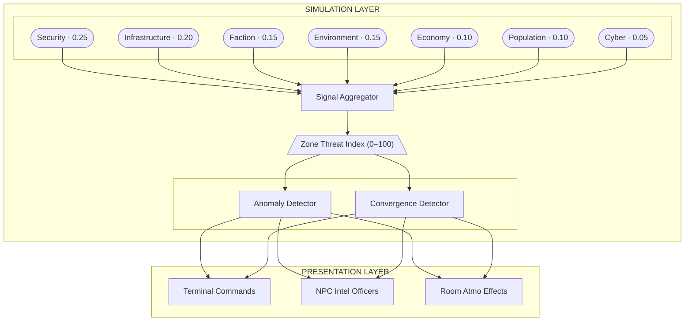
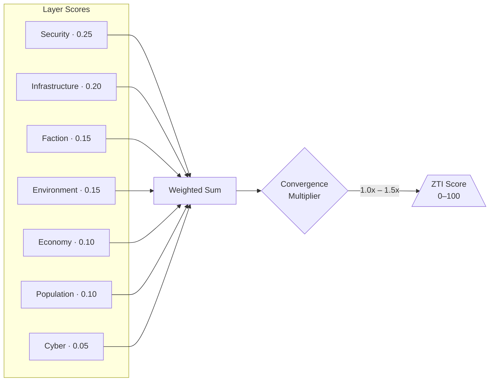
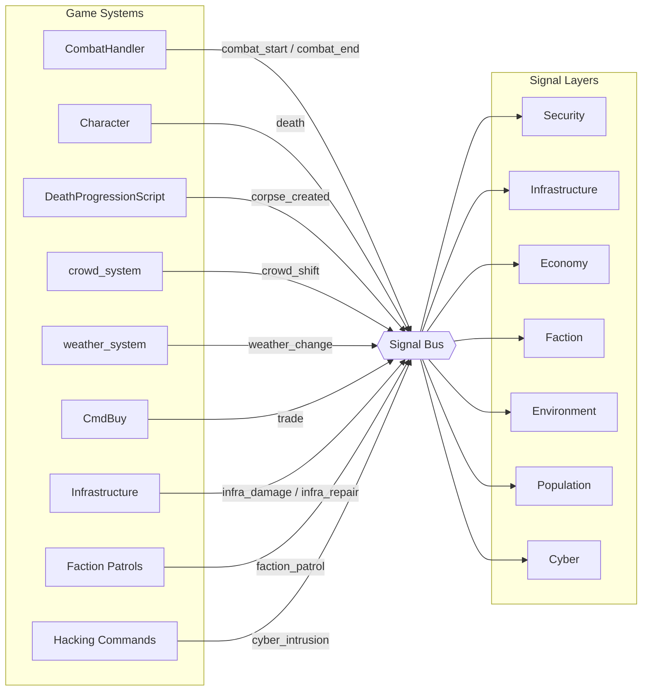
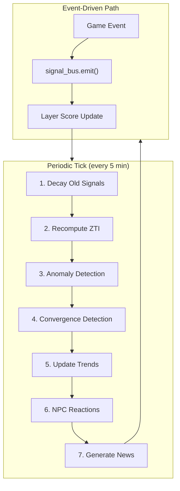
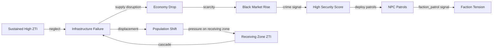

# World State Intelligence System (WSIS) Specification

> **Status:** P0 **BUILT AND LIVE** (`world/wsis.py`, 2026-08-21) — the
> signal bus. Everything above it is design. Tracking #303, which is
> stale and still says no implementation exists.
>
> **Vision rewritten 2026-08-24** on the owner's call: intelligence is
> a sourced, fallible, tradeable commodity — not an objective readout.

---

## The thesis

**WSIS is the colony's capacity to notice itself.**

That framing comes from P0's own docstring, and it is the whole point:

> *Collapse is legitimate content. The colony is not propped up, and
> players and NPCs are meant to decide what state it ends up in. That
> only works if its state is LEGIBLE. The medical collapse of
> 2026-08-20 ran for hours in plain sight — both doctors soulless,
> casualties bleeding out — and nothing anywhere said so.*

A world allowed to fail needs a way to say that it is failing.
Otherwise failure is indistinguishable from nothing happening, and the
consequence lands on nobody.

### What this is NOT

**Not a dashboard.** An earlier draft of this spec was built around a
real-time intelligence dashboard: seven signal layers, toggleable
views, a terminal showing `Sector 7 · 78 ▲`. That design has been
withdrawn, for two reasons.

First, **nothing else in this colony works that way.** Information
here has a mouth. It comes through the radio, through dispatch,
through Sable, through the Rook, through a board somebody keeps. A
screen that objectively reports the truth to anyone who walks up would
be the only thing in the game speaking with the voice of God.

Second, **the layers were inherited rather than derived.** They came
from an external tool's categories, not from this colony's systems —
which is why the bus today declares seven layers and only four of them
have a single signal wired to them. `environment`, `faction` and
`cyber` are empty boxes waiting for games that do not exist yet.

That is also why the old spec claimed WSIS "depends on faction /
infrastructure / economy systems that are themselves unbuilt." **P0
disproved that dependency** by emitting from souls, posts and deaths —
systems that do exist. WSIS consumes what is real and grows layers as
the world grows them. It never blocks on a system that hasn't been
built.

---

## The three movements

Not eight phases. Three, in dependency order.

### 1. Legibility — ✅ BUILT

The colony records what happens to it. Signals are emitted nearly
free, decay on a per-layer half-life so the picture is always
"lately" and never "ever", and **never read back into behaviour**.
WSIS observes. That constraint is what let it ship while everything
else waits on tuning: an observer needs no balance, because it reports
whatever the numbers currently are.

### 2. Interpretation — turning signal into a claim

Zones, temporal baselines, anomaly detection, convergence. The engine
sections below are largely unchanged and still good. This is the part
that decides that the Snailery being loud for six hours is *a fact
about the colony* rather than forty rows in a ring buffer.

### 3. Circulation — how a claim reaches a person

The departure, and the cheap part, because **every surface already
exists.** The Rook broadcasts nightly. Dispatch reads a board.
Bartenders have opinions. A decker will eventually read files.

---

## Provenance: the rule that makes this the colony's system

**The same discipline as BOLO provenance** (#2247), which the owner
already ruled on: the system knows the truth, the player gets a
possibly-false narrator, and *how you learned something is part of
what you know.*

One fact — *the Snailery is the loudest zone in the colony* — should
arrive very differently depending on the door it came through:

| source | fidelity | cost |
|---|---|
| Constabulary terminal | measured, precise, current | requires access |
| The Rook, 88.8 | true-ish, editorialised, hours late | free; everyone hears it |
| A bartender | one incident, extrapolated wildly | a drink |
| A decker's stolen dump | raw signal, no interpretation | a run |
| An NPC who was there | narrow, vivid, and possibly lying | a favour |

**Nobody gets the objective number for free.** That single rule turns
a readout into content: intelligence becomes something you buy, trade,
steal, or are lied to about, which is exactly the favour / reputation
/ gig economy that the growth direction names as the spine.

It also lands the net layer naturally. "Everything is a file" and
"the colony's own state is a file" are the same sentence — WSIS is
what a decker reads, and interpretation is what they steal.

---

## Held for WSIS: ground truth the world already computes (#2260)

**Not a gap. A metric waiting for its reader** (owner ruling
2026-08-25).

`world.director.security.is_the_right_person(event, candidate)` (from
#2247) compares a person a unit has detained against `event.source` —
the truth the system quietly keeps while the robot acts on a claim
that may be wrong. Vague reports getting the wrong person grabbed is
deliberate: #2246 made the description fallible on purpose.

**Nothing calls it, and nothing should yet.** The value of that
function is not a punishment hook; it is that the colony can COUNT how
often its security force is wrong. That is a WSIS reading, not a
gameplay rule:

* **wrongful detention rate** — per corridor, per unit, per shift. A
  security layer that only counts incidents describes a busy district;
  one that counts wrong arrests describes a *badly policed* one, and
  those are different facts about a place.
* **report quality per caller** — the false-report strike record
  (Phase 3, #2256, already closes calls `unfounded` and says so on the
  air). Held against the caller's VOICE UID, which exists, and which a
  modulator already defeats — the counter-tradecraft is built in.

Both fit the provenance model without modification. "The constabulary
detains the wrong person on Volta about a third of the time" is
exactly the sort of claim that should be **expensive and sourced**: a
precinct terminal knows it precisely, the Rook says it with a sneer
and no number, and a decker takes the raw log.

**Do not wire it to consequences first.** A strike record that docks
reputation before anybody can SEE the count is a rule the colony
enforces in secret. Legibility comes before consequence — which is the
thesis of this whole document.

---

## Signal layers — what is real, and what is aspirational

The bus declares seven. **Four carry signals today.** The rest are
kept only as named intentions, and each states what would have to
exist first. A layer earns its place by having a system that emits to
it — never by analogy to somebody else's categories.

| layer | state | emitting today |
|---|---|
| **security** | ✅ live | death, killing, assault, robbery, casualty, casualty_untreated |
| **population** | ✅ live | arrival, resleeve, went_hungry, homeless, undressed |
| **infrastructure** | ✅ live | post_vacant, post_unsouled, machine_defect, travel_stalled, plan_faulted |
| **economy** | ✅ live (thin) | sale, wage_paid, till_empty, supply_dry |
| **faction** | ⏳ aspirational | needs the NPC-only faction layer |
| **cyber** | ⏳ aspirational | needs the net layer |
| **environment** | ⏳ aspirational | needs weather/hazard systems to emit; the terraform failure and the Boot breach are the obvious first sources |

Note what the live four already describe: **a colony that starves,
loses its staff, and bleeds.** That is not a small picture. The
medical collapse would have been visible in three of these four.

---

### Scale

Starting scope: a single offworld colony on a planetary body. The zone abstraction is scale-agnostic -- zones can represent rooms, districts, stations, or entire planetary regions. As the game expands to a full solar system, the same system scales by adding zone hierarchies (zone -> sector -> region -> body).

---

## Architecture



### Module Structure

Follows the established crowd/weather pattern: package with `__init__.py` exposing a global singleton, a `*_system.py` with core logic, and supporting modules.

```
world/
  intel/
    __init__.py              # Exposes global `intel_system` singleton
    zone_system.py           # Zone registry, ZTI computation
    signal_bus.py            # Event aggregation, signal fusion
    anomaly.py               # Welford's algorithm, baseline tracking
    convergence.py           # Multi-signal convergence detection
    layers/
      __init__.py
      security.py            # Combat events, crime, faction hostility
      infrastructure.py      # Power, life support, comms, docking
      economy.py             # Trade, resource flow, market state
      faction.py             # Faction tensions, territorial control
      environment.py         # Atmo quality, radiation, weather severity
      population.py          # Crowd displacement, casualties, migration
      cyber.py               # Network intrusions, system breaches
    reports/
      __init__.py
      brief_generator.py     # Zone/colony-level intelligence briefs
      report_messages.py     # Message pools for terminal readouts
    constants.py             # All WSIS constants
```

---

## Zone System

### Zone Definition

### Corridors, not districts — corrected 2026-08-24

An earlier draft of this section said "named districts, hand-authored".
**That was wrong, and BUILDING_PLAYBOOK §1.5 already said so** — a
section explicitly marked owner-set, which builds "do not argue with":

> **The plan: corridors, not zones.** The city organizes the way
> cities organically form — along the routes work travels.
> **Industrial corridors**: the freight run from the Landing Pad
> toward the Processor's skirt; power down Volta; fab-labor along
> Riveter's Way. **Cultural corridors**: each quarter's life
> concentrates on a main street.

So the aggregation unit is the **corridor** — the street work travels
along — with **Northside / Southside** as the coarse gradient above it.
Not invented districts. The playbook already names them: Maxwell,
Pessoa, the Spillane, Riveter's Way, Volta.

**This is better for circulation, not just more consistent.** A street
is more sayable than a district, and it is how people actually give
directions. "Stay off Volta tonight" and "Pessoa's gone quiet since
the shrine went up" are things the Rook can say on air and a bartender
can repeat. "Sector 7 is at 78" is not.

It also matches how convergence already works in this city: the
playbook engineers venues to cluster on a spine, so a loud corridor is
a real thing that a loud rectangle is not.

### It is cheaper than expected

Measured against the live world, 2026-08-24: **1070 rooms, of which
424 already carry a corridor name in the room key** — Brackett 242,
Kaspar 31, Marlowe 29, Maxwell 29, Pessoa 25, Hammett 25, Bhavani 17,
Volta 17, the Spillane 17, Riveter's 5.

The remaining 646 are interiors, which inherit from the building they
sit in rather than needing their own authoring. So the zone map is
mostly derivable from names that already exist, with hand-authoring
reserved for the cases that need judgement.

**Today the bus keys on the room name itself**, which is why it
reports "Escallier Snailery" rather than a corridor. That is the
change: aggregate at the corridor and keep the room as the note.

### Status: analysis only

Not being built (owner, 2026-08-24). WSIS is a large undertaking and
**rounding out NPC management stays the priority**. This section is
recorded so the next person starts from the corrected unit rather than
re-deriving districts.

```python
# New AttributeProperty fields on Room typeclass
zone = AttributeProperty("unzoned", category="intel")
zone_type = AttributeProperty("residential", category="intel")
# Types: residential, commercial, industrial, military,
#        infrastructure, docking, medical, administrative
```

### Zone Registry

A persistent Script that maintains the zone map and computes ZTI scores.

```python
class ZoneRegistry(DefaultScript):
    """
    Global singleton script. Tracks all zones, their rooms,
    and computes Zone Threat Index per zone on each tick.
    """
    # db.zones = {
    #   "sector_7": {
    #       "name": "Sector 7 - Habitation",
    #       "type": "residential",
    #       "rooms": [dbref_list],
    #       "zti_score": 42,          # 0-100 composite
    #       "layer_scores": {
    #           "security": 65,
    #           "infrastructure": 30,
    #           "economy": 25,
    #           "faction": 50,
    #           "environment": 40,
    #           "population": 35,
    #           "cyber": 20,
    #       },
    #       "trend": "rising",        # rising/stable/falling
    #       "convergence_level": 0,   # 0-3 (none/low/medium/high)
    #   }
    # }
```

### ZTI Computation

A composite index is a weighted blend across layers rather than a
sum, so one loud layer cannot masquerade as a failing district:

| Layer | Weight | Signals |
|---|---|
| Security | 0.25 | Combat events, murders, armed NPCs, faction hostility in zone |
| Infrastructure | 0.20 | Power grid %, life support %, comms uptime, structural damage |
| Faction | 0.15 | Faction tension scores, territorial disputes, contested zones |
| Environment | 0.15 | Atmospheric quality, radiation, weather severity, hazards |
| Economy | 0.10 | Trade volume, resource scarcity, black market activity |
| Population | 0.10 | Crowd displacement, casualties, migration pressure |
| Cyber | 0.05 | Network breaches, system intrusions, data theft |

```
ZTI = sum(layer_score * weight) * convergence_multiplier
```

Where `convergence_multiplier` increases when multiple layers spike simultaneously (1.0 normal, up to 1.5 for 4+ layers elevated).



### Escalation Tiers

| ZTI Range | Status | Effects |
|---|---|
| 0-20 | STABLE | Normal operations |
| 21-40 | ELEVATED | Minor atmospheric changes, increased NPC patrols |
| 41-60 | UNSTABLE | Visible security presence, crowd nervousness |
| 61-80 | CRITICAL | Lockdowns, infrastructure strain, NPC displacement |
| 81-100 | EMERGENCY | Full crisis -- martial law, system failures cascade |

---

## Signal Layers

### Security Layer

**Signals consumed:**
- Combat events (from `CombatHandler` -- emit signal on `start_combat`, `end_combat`)
- Deaths/corpse creation (from `DeathProgressionScript`)
- Weapon discharges (gunfire heard in adjacent rooms)
- NPC faction patrol encounters
- Arrests/detentions

**Score computation:** Rolling window (e.g., last 6 game-hours) of weighted security events normalized by zone room count.

### Infrastructure Layer

Colony infrastructure systems, each independently trackable:

| System | Game Mechanic |
|---|---|
| Power Grid | Undersea cables / pipelines | % capacity per zone, sector blackouts |
| Life Support | Climate anomaly panel | Atmospheric quality, O2 levels, scrubber status |
| Communications | Internet outages | Comms relay status, jamming, signal degradation |
| Docking | Strategic ports | Landing pad availability, traffic volume |
| Water/Recycling | Infrastructure health | Contamination levels, rationing triggers |
| Transit System | Trade routes | Rail/tram operational status, corridor throughput |

Each system has: `capacity` (0-100%), `status` (operational/degraded/offline/critical), `last_incident` timestamp, `trend` (improving/stable/degrading).

### Economy Layer

- **Token economy:** Track velocity (tokens traded per period), inflation/deflation signals
- **Shop inventory levels:** Scarcity indices for weapon/medical/general goods per zone
- **Black market activity:** Illicit trades, contraband detection events
- **Resource extraction:** Mining/salvage output per zone
- **Supply routes:** Convoy status between zones, and the chokepoints they must pass

### Faction Layer

- **Faction tension matrix:** Pairwise tension scores between factions (0-100)
- **Territorial control:** Which faction controls which zones, contested zones flagged
- **Force disposition:** Faction NPC patrol strength per zone
- **Diplomatic state:** Allied/neutral/hostile per faction pair
- **Player faction actions:** Player kills, trade, espionage contribute to faction scores

### Environment Layer

- **Weather severity:** Already tracked by `weather_system` -- integrate its intensity level directly
- **Atmospheric hazards:** Radiation zones, toxic leaks, pressure breaches
- **Seismic events:** Tremors, structural instability (planetary body geology)
- **Fire/thermal:** Fires in sectors, heat exchanger failures
- **External threats:** Meteor impacts, solar flare effects (long-term escalation arc for solar system expansion)

### Population Layer

- **Crowd system integration:** Already exists (`world/crowd/`) -- crowd levels per room aggregated to zone level
- **Displacement events:** NPCs fleeing high-ZTI zones (crowd_base_level shifts dynamically)
- **Casualty tracking:** Deaths per zone per period
- **Medical load:** Injured characters per zone, medical facility saturation
- **Migration pressure:** Population flow between zones, read from both ends — who is leaving and who is arriving

### Cyber/Network Layer

- **System intrusions:** Hacking events against colony infrastructure
- **Data breaches:** Intelligence leaks, faction secrets exposed
- **Comms interception:** Eavesdropping events
- **AI/automation disruptions:** Rogue automation, drone hijacking
- **Network integrity:** Colony mesh network health, node failures

---

## Signal Bus and Event Aggregation

### Design

An event-driven bus where game systems emit signals, and the aggregator routes them to the appropriate layer and zone.

```python
class SignalBus:
    """
    Central event aggregator. Game systems emit signals;
    the bus routes them to the appropriate layer and zone.
    """

    def emit(self, signal_type, zone_id, severity, metadata=None):
        """
        Args:
            signal_type: "combat_start", "death", "power_failure",
                         "faction_patrol", "trade_completed", etc.
            zone_id: which zone this affects
            severity: 0.0-1.0
            metadata: dict of additional context
        """
```

### Signal Sources

Hooks into existing Gelatinous systems with minimal changes -- add `signal_bus.emit()` calls at natural hook points:



| Existing System | Hook Point | Signal Emitted |
|---|---|
| `CombatHandler` | `start_combat()` | `combat_start` |
| `CombatHandler` | `stop_combat_logic()` | `combat_end` |
| `Character` | `at_death()` | `death` |
| `DeathProgressionScript` | corpse creation | `corpse_created` |
| `CmdThrow` | grenade explosion | `explosion` |
| `crowd_system` | crowd level recalculation | `crowd_shift` |
| `weather_system` | `set_weather()` | `weather_change` |
| `CmdBuy` | successful purchase | `trade` |
| New: infrastructure system | damage/repair events | `infra_damage`, `infra_repair` |
| New: faction patrol scripts | patrol movement | `faction_patrol` |
| New: hacking commands | intrusion attempts | `cyber_intrusion` |

### Integration Example

```python
# In CombatHandler (world/combat/handler.py) -- minimal change
def start_combat(self):
    # ... existing code ...
    from world.intel import signal_bus
    zone_id = self.db.managed_rooms[0].db.zone if self.db.managed_rooms else None
    if zone_id:
        signal_bus.emit(
            "combat_start",
            zone_id,
            severity=0.5,
            metadata={"combatants": len(self.db.combatants)}
        )
```

---

## Update Model

Hybrid: event-driven ingestion (emitting is nearly free) plus periodic recomputation (scoring is not).

- **Event-driven:** Signals update layer scores immediately when emitted. A combat starting in Sector 7 immediately nudges that zone's security score.
- **Periodic tick:** A `ZoneTickScript` (Evennia Script, `interval=300` / 5 minutes) runs:
  1. Decay old signals (sliding window -- events age out over configurable periods)
  2. Recompute ZTI composite scores per zone
  3. Run anomaly detection against baselines
  4. Run convergence detection across layers
  5. Update trends (rising/stable/falling based on score delta)
  6. Trigger NPC reactions to ZTI changes (patrol reinforcements, civilian flight, lockdowns)
  7. Generate news items for significant state changes



---

## Anomaly Detection

### Design

```python
class AnomalyDetector:
    """
    Tracks rolling baselines per (zone, signal_type) pair.
    Uses Welford's online algorithm for streaming mean/variance.
    Flags deviations that exceed z-score thresholds.
    """
    # db.baselines = {
    #   ("sector_7", "combat_start"): {
    #       "count": 450,      # total observations
    #       "mean": 2.3,       # events per tick window
    #       "m2": 156.7,       # Welford's M2 accumulator
    #       "variance": 0.35,  # computed from m2/count
    #   }
    # }

    ALERT_THRESHOLDS = {
        "elevated": 1.5,    # Unusual activity
        "high": 2.0,        # Significant deviation
        "critical": 3.0,    # Extreme anomaly
    }
```

When an anomaly is detected, it generates an **intelligence finding** -- a structured alert with context:

```python
{
    "zone": "sector_7",
    "signal_type": "combat_start",
    "observed": 8,
    "baseline_mean": 2.3,
    "z_score": 3.2,
    "severity": "critical",
    "message": "Combat frequency 3.2 sigma above baseline for Sector 7"
}
```

### Welford's Algorithm

Chosen because it computes running mean and variance in a single pass with O(1) memory per tracked pair. No need to store historical event lists.

```python
def update_baseline(self, zone_id, signal_type, observed_count):
    key = (zone_id, signal_type)
    baseline = self.db.baselines.get(key, {"count": 0, "mean": 0.0, "m2": 0.0})

    baseline["count"] += 1
    delta = observed_count - baseline["mean"]
    baseline["mean"] += delta / baseline["count"]
    delta2 = observed_count - baseline["mean"]
    baseline["m2"] += delta * delta2

    if baseline["count"] > 1:
        baseline["variance"] = baseline["m2"] / (baseline["count"] - 1)

    self.db.baselines[key] = baseline
```

---

## Convergence Detection

### Design

If 3+ layers are simultaneously elevated (z-score > 1.5) in the same zone, that zone is flagged as a **convergence zone**. The convergence level (0-3) multiplies the ZTI score.

| Elevated Layers | Convergence Level | ZTI Multiplier | Meaning |
|---|---|---|---|
| 0-2 | 0 (none) | 1.0x | Isolated incidents |
| 3 | 1 (low) | 1.15x | Correlated activity |
| 4 | 2 (medium) | 1.3x | Coordinated threat likely |
| 5+ | 3 (high) | 1.5x | Multi-domain crisis |

**Example:** Sector 7 has elevated security (gang violence) + degraded infrastructure (power outage) + faction tension spike = convergence level 1. If economy also drops (shops looted) = convergence level 2. This likely means a coordinated faction move is underway.

---

## Player-Facing Intelligence Interface

> **Read this section as ONE DOOR, not the door.** The terminal design
> below is still good and still wanted — it is the source that tells
> the truth plainly, gated by access rather than by fidelity. But it
> is one row in the provenance table above, not the product. The Rook,
> a bartender, a rumour and a stolen file are the others, and most
> players should meet the colony's state through one of those long
> before they ever stand in front of a screen.


### Intelligence Terminals

Interactable objects placed in key rooms (command centers, security offices, public information kiosks). Different terminal types may have different access levels.

```
> use terminal

+==========================================+
|  COLONY INTELLIGENCE TERMINAL v2.1       |
|  Classification: UNRESTRICTED            |
+==========================================+
|                                          |
|  ZONE THREAT INDEX -- Colony Overview    |
|                                          |
|  Sector 7 (Hab)    ||||||||..  78  ^     |
|  Sector 3 (Ind)    ||||||....  55  -     |
|  Sector 1 (Admin)  |||.......  28  v     |
|  Docking Ring       ||||......  42  ^     |
|  Medical Wing       ||........  15  -     |
|                                          |
|  [1] Zone Detail   [2] Alerts            |
|  [3] Factions      [4] Infrastructure    |
|  [5] Economy       [6] Intel Brief       |
+==========================================+
```

Commands: `terminal status`, `terminal zone <name>`, `terminal alerts`, `terminal factions`, `terminal brief <zone>`.

### Zone Brief

```
> terminal brief sector_7

+==========================================+
|  ZONE BRIEF: SECTOR 7 -- HABITATION      |
+==========================================+
|                                          |
|  THREAT INDEX: 78/100 [CRITICAL] ^       |
|                                          |
|  Security    ||||||||..  82              |
|  Infra       ||||......  38              |
|  Faction     ||||||||..  75              |
|  Environment |||.......  32              |
|  Economy     ||||||....  55              |
|  Population  |||||||...  68              |
|  Cyber       |.........  12              |
|                                          |
|  ACTIVE SIGNALS:                         |
|  * 3 combat events (last 6h)            |
|  * 1 death (2h ago)                     |
|  * Power grid at 62%                    |
|  * Crowd displacement detected          |
|                                          |
|  CONVERGENCE: HIGH (3 layers elevated)   |
|                                          |
|  INTEL BRIEF:                            |
|  Sector 7 instability driven by ongoing  |
|  faction conflict between [Syndicate]    |
|  and [Colony Security]. Infrastructure   |
|  degradation correlates with increased   |
|  security events. Population displace-   |
|  ment toward Sector 1 observed.          |
|                                          |
|  TREND: Rising over last 24h            |
|  ANOMALIES: Combat frequency 2.8s above |
|  baseline for this zone                 |
+==========================================+
```

### Colony News Network (CNN)

An in-game news/rumor system where game events generate news items:

- Combat events produce headlines: "Shootout in Sector 7 leaves one dead"
- Infrastructure failures: "Power grid fluctuations reported in Habitation sector"
- Faction movements: "Syndicate patrol strength increased near Docking Ring"
- Entity extraction links news to factions, locations, characters
- Players can subscribe to keyword monitors at terminals
- News items have severity levels, age out over time
- Accessible via terminals, public bulletin boards, or NPC chatter

### Room Atmospheric Integration

Following the established crowd/weather pattern where `get_*_contributions(room, looker)` returns formatted text layered into `return_appearance()`:

```python
class IntelSystem:
    def get_intel_contributions(self, room, looker):
        """Called from room.return_appearance(), like weather/crowd."""
        zone_id = room.db.zone
        if not zone_id:
            return ""
        zti = self.get_zone_zti(zone_id)
        if zti < 40:
            return ""
        # Select atmospheric message based on ZTI tier and dominant layer
        # High security: "Patrol drones sweep overhead in tight formations."
        # High infrastructure: "Lights flicker intermittently overhead."
        # High faction: "Tension hangs in the air between armed groups."
        ...
```

Room integration in `typeclasses/rooms.py`:

```python
# In return_appearance(), alongside existing calls:
crowd_text = crowd_system.get_crowd_contributions(self, looker)
weather_text = weather_system.get_weather_contributions(self, looker)
intel_text = intel_system.get_intel_contributions(self, looker)  # NEW
```

Message pools follow the same sensory category pattern as crowd/weather (visual, auditory, atmospheric), with pools organized by dominant threat layer and ZTI tier.

### NPC Intelligence Officers

NPCs stationed at command posts who deliver zone briefs verbally with personality. Use existing NPC/conversation patterns. They provide the same data as terminals but filtered through character voice -- a grizzled security chief vs a nervous analyst vs a faction informant each present the same ZTI data differently.

---

## Simulation Dynamics

### Feedback Loops

WSIS observes; the world is what reacts. These are the loops the
colony should close on itself once something is allowed to read the
bus and act (see the standing constraint: the bus never pushes):



| Trigger | Effect |
|---|---|
| High security score | NPC faction patrols increase in zone | Military deployment to conflict zones |
| Infrastructure failure | Crowd displacement, economy drops | Climate displacement, infrastructure cascade |
| Faction territory gain | Rival faction escalation response | ACLED conflict escalation tracking |
| Economy collapse in zone | Black market activity rises | Sanctions regime effects |
| Multiple convergence zones | Colony-wide emergency state declared | Strategic posture assessment (composite risk) |
| High population displacement | Receiving zones get population pressure | HAPI humanitarian flows (dual-perspective) |
| Sustained high ZTI | Infrastructure degrades faster (neglect) | Compounding instability in monitored nations |

### NPC Faction Responses

Factions react to ZTI changes in their controlled/contested zones:

- **Security forces:** Deploy more patrols to high-ZTI zones, establish checkpoints at CRITICAL+
- **Criminal factions:** Exploit infrastructure failures and power vacuums, increase activity in degraded zones
- **Civilian NPCs:** Flee high-ZTI zones -- crowd_base_level decreases in source zone, increases in destination
- **Administration:** Issue zone lockdowns and curfews at EMERGENCY tier, restrict transit
- **Medical services:** Shift resources toward high-casualty zones

### Player Impact

Player actions contribute to zone state through the signal bus:

- **Combat/kills** raise security score
- **Faction-aligned actions** shift faction tension matrix
- **Trade** affects economy layer
- **Sabotage/hacking** affects infrastructure and cyber layers
- **Healing/stabilization** reduces population layer pressure

Players can meaningfully influence which zones are stable and which spiral -- but the simulation has enough NPC-driven inertia that the world doesn't feel static when players are offline.

---

## Evennia Implementation Patterns

### Scripts

| Script | Type | Interval | Purpose |
|---|---|---|---|
| `ZoneRegistryScript` | Global, persistent | None | Stores zone data, no tick needed |
| `ZoneTickScript` | Global, persistent | 300s | Recomputes ZTI, anomaly detection, NPC reactions |
| `SignalBusScript` | Global, persistent | None | Event-driven only, no tick |
| `AnomalyBaselineScript` | Global, persistent | 3600s | Periodic baseline recalculation |

### Data Storage

Following Evennia conventions (use `db` for persistent, `ndb` for temporary):

- **Zone data:** `ZoneRegistryScript.db.zones` (persistent dict)
- **Signal history:** `SignalBusScript.db.signals` (rolling list, capped at configurable max entries)
- **Anomaly baselines:** `AnomalyBaselineScript.db.baselines` (persistent dict, keyed by (zone, signal_type) tuples)
- **Per-room zone assignment:** `room.db.zone` (AttributeProperty, category="intel")
- **Active alerts:** `ZoneRegistryScript.db.active_alerts` (list of finding dicts)
- **News items:** `SignalBusScript.db.news` (rolling list with timestamps, severity, zone, text)

### Constants

All WSIS constants centralized in `world/intel/constants.py`, following the pattern in `world/combat/constants.py`:

```python
# Zone Threat Index
ZTI_WEIGHT_SECURITY = 0.25
ZTI_WEIGHT_INFRASTRUCTURE = 0.20
ZTI_WEIGHT_FACTION = 0.15
ZTI_WEIGHT_ENVIRONMENT = 0.15
ZTI_WEIGHT_ECONOMY = 0.10
ZTI_WEIGHT_POPULATION = 0.10
ZTI_WEIGHT_CYBER = 0.05

# Escalation tiers
ZTI_TIER_STABLE = (0, 20)
ZTI_TIER_ELEVATED = (21, 40)
ZTI_TIER_UNSTABLE = (41, 60)
ZTI_TIER_CRITICAL = (61, 80)
ZTI_TIER_EMERGENCY = (81, 100)

# Anomaly thresholds (z-score)
ANOMALY_ELEVATED = 1.5
ANOMALY_HIGH = 2.0
ANOMALY_CRITICAL = 3.0

# Convergence
CONVERGENCE_THRESHOLD = 1.5  # z-score for a layer to count as "elevated"
CONVERGENCE_LEVEL_THRESHOLDS = {0: 2, 1: 3, 2: 4, 3: 5}
CONVERGENCE_MULTIPLIERS = {0: 1.0, 1: 1.15, 2: 1.3, 3: 1.5}

# Tick intervals (seconds)
ZONE_TICK_INTERVAL = 300        # 5 minutes
BASELINE_TICK_INTERVAL = 3600   # 1 hour

# Signal types
SIGNAL_COMBAT_START = "combat_start"
SIGNAL_COMBAT_END = "combat_end"
SIGNAL_DEATH = "death"
SIGNAL_CORPSE_CREATED = "corpse_created"
SIGNAL_EXPLOSION = "explosion"
SIGNAL_CROWD_SHIFT = "crowd_shift"
SIGNAL_WEATHER_CHANGE = "weather_change"
SIGNAL_TRADE = "trade"
SIGNAL_INFRA_DAMAGE = "infra_damage"
SIGNAL_INFRA_REPAIR = "infra_repair"
SIGNAL_FACTION_PATROL = "faction_patrol"
SIGNAL_CYBER_INTRUSION = "cyber_intrusion"

# Signal-to-layer routing
SIGNAL_LAYER_MAP = {
    SIGNAL_COMBAT_START: "security",
    SIGNAL_COMBAT_END: "security",
    SIGNAL_DEATH: "security",
    SIGNAL_CORPSE_CREATED: "security",
    SIGNAL_EXPLOSION: "security",
    SIGNAL_CROWD_SHIFT: "population",
    SIGNAL_WEATHER_CHANGE: "environment",
    SIGNAL_TRADE: "economy",
    SIGNAL_INFRA_DAMAGE: "infrastructure",
    SIGNAL_INFRA_REPAIR: "infrastructure",
    SIGNAL_FACTION_PATROL: "faction",
    SIGNAL_CYBER_INTRUSION: "cyber",
}

# Debug
DEBUG_PREFIX_INTEL = "INTEL"
DEBUG_PREFIX_ZONE = "ZONE"
DEBUG_PREFIX_SIGNAL = "SIGNAL"
DEBUG_PREFIX_ANOMALY = "ANOMALY"
```

---

## What This Spec Does NOT Cover

These are future phases or separate specs:

- **Player faction management commands** (create faction, recruit, declare war)
- **Hacking/cyber gameplay** (actual commands for intrusion/defense)
- **Infrastructure repair gameplay** (engineering skill tree, repair commands)
- **Trade/economy commands** (market terminals, commodity buy/sell)
- **Satellite/orbital tracking** (future solar system expansion)
- **Sensor modes** (CRT/NVG/FLIR from WorldView -- could map to terminal display modes)
- **ASCII zone maps** (terminal-rendered maps showing zone layout and threat coloring)
- **Inter-zone transit system** (tram/rail gameplay)
- **Colony-wide emergency protocols** (martial law gameplay, curfew enforcement)

---

## Implementation Priority

**The old phase table is withdrawn — reality already reordered it.**
It had the signal bus as Phase 2, behind zones and terminals. The bus
shipped FIRST (#2228-era work, live 2026-08-21) precisely because it
was the piece that needed nothing: no zones, no faction system, no
tuning. Observation is always the cheapest thing to build and the
safest thing to be wrong about.

That is the ordering principle worth keeping: **build the part that
observes, then the part that interprets, then the part that speaks.**

| | scope | state |
|---|---|---|
| **Legibility** | the signal bus, decay, checkpointing | ✅ live |
| **Zones** | named districts on rooms; the bus keys on them instead of room names | next |
| **Interpretation** | baselines per (zone, layer), anomaly z-scores, convergence | after zones |
| **Circulation — the Rook** | he already broadcasts nightly and already has opinions. The cheapest mouth in the colony | after interpretation |
| **Circulation — a terminal** | one door among several, gated by access, and the only source that tells the truth plainly | any time after zones |
| **Circulation — rumour** | NPCs repeat what they half-know; fidelity degrades with each retelling | after interpretation |
| **Circulation — the net layer** | raw signal, stealable, uninterpreted | with decking |
| **Layers** | faction / cyber / environment | each lands when its emitting system does, never before |

**Nothing here needs a balance pass**, which is the other reason this
is the right thing to work on now: WSIS reports whatever the numbers
currently are. When bleeding, infection, wages and damage are finally
tuned, WSIS does not need retuning — it just starts describing a
better-balanced world.

